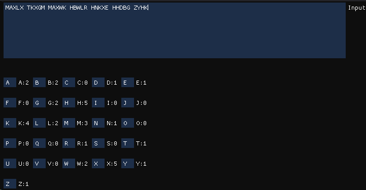
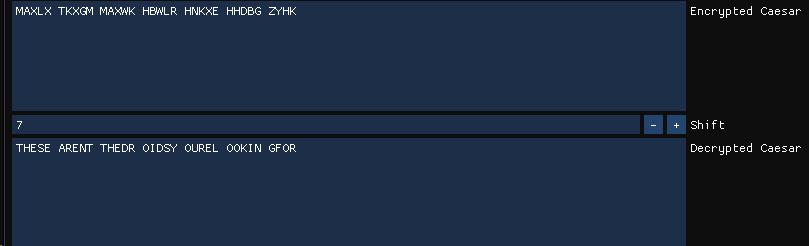
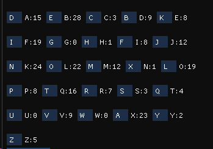
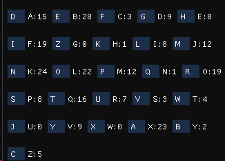
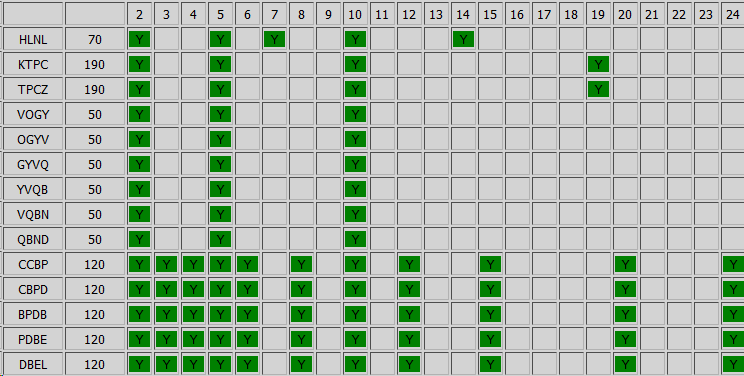
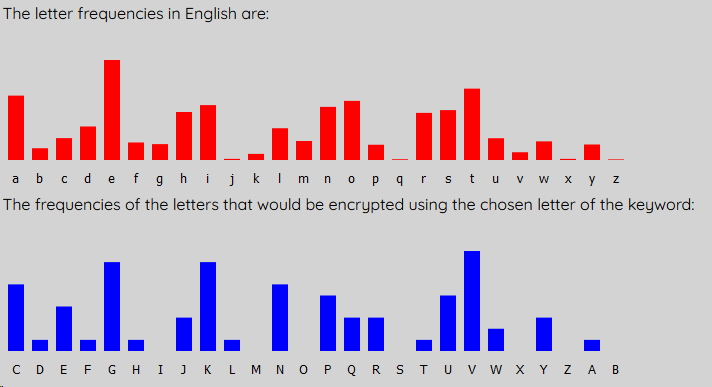
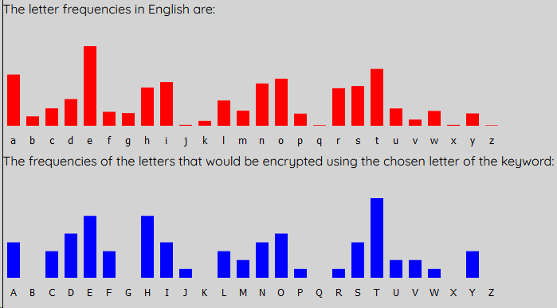

# Lucrearea de laborator Nr.1 la Criptanaliza

A elaborat: *Curmanschii Anton, IA1901*.

Vedeți [Github](https://github.com/AntonC9018/uni_cryptanalysis). 

## Conținutul

- [Lucrearea de laborator Nr.1 la Criptanaliza](#lucrearea-de-laborator-nr1-la-criptanaliza)
  - [Conținutul](#conținutul)
  - [Introducere](#introducere)
  - [Exercițiile](#exercițiile)
    - [1. Cifrul Caesar.](#1-cifrul-caesar)
    - [2. Cifru cu substituție](#2-cifru-cu-substituție)
    - [Ex. 3 b)](#ex-3-b)
    - [Ex.3 a)](#ex3-a)
    - [Metoda Kasiski Ex.4 a)](#metoda-kasiski-ex4-a)
    - [Metoda Kasiski Ex.4 b)](#metoda-kasiski-ex4-b)
    - [Metoda Kasiski, Ex.4 c)](#metoda-kasiski-ex4-c)
    - [Metoda Kasiski, Ex.4 d)](#metoda-kasiski-ex4-d)
    - [Metoda Kasiski, Ex.4 e)](#metoda-kasiski-ex4-e)
    - [Metoda Kasiski, Ex.4 f)](#metoda-kasiski-ex4-f)
  - [Remarci](#remarci)
    - [Binding-urile Imgui](#binding-urile-imgui)
    - [De ce nu m-am oprit la binding-urile inițiale pe care le-am găsit și înainte de aceste 4 zile?](#de-ce-nu-m-am-oprit-la-binding-urile-inițiale-pe-care-le-am-găsit-și-înainte-de-aceste-4-zile)

## Introducere

Am implementat o interfață grafică în limbajul [D](https://dlang.org/), utilizând [Imgui](https://github.com/ocornut/imgui) pe baza de [GLFW](https://www.glfw.org/) și [OpenGL](https://www.opengl.org/).

## Exercițiile

### 1. Cifrul Caesar.

**Sarcina:** Folosind analiza frecvenței literelor, determinați conținutul următorului mesaj care a fost obținut prin aplicarea cifrului Caesar.

```
MAXLX TKXGM MAXWK HBWLR HNKXE HHDBG ZYHK
```

Am făcut un modul ce vizualizează frecvențele literelor într-un text.
Încă nu fac sortarea după frecvența.



Codul este destul de simplu, [vedeți după link](https://github.com/AntonC9018/uni_cryptanalysis/blob/9d20c6838edfa86313602813d1a53d7b6ab890b3/source/app.d#L67-L210).

Momentul principal care calculează frecvențele este realizat astfel.
Am făcut o structură ce permite indexarea unui tablou prin litere.
Funcția `countLetterFrequencies()` trece prin toate literele unui 'slice' (pointer + lungime) nul-terminat (lungimea aici este utilizată numai pentru bounds checking, previne bug-uri).
```d
struct AlphabetMap(T)
{
    T[letterCount] arrayof;

    ref auto opIndex(char ch)
    {
        return arrayof[ch - 'A'];
    }
}

AlphabetMap!ulong countLetterFrequencies(char[] str)
{
    import std.ascii;

    AlphabetMap!ulong result;

    for (size_t i = 0;; i++)
    {
        if (str[i] == 0)
            return result;

        str[i] = toUpper(str[i]);

        if (isAlpha(str[i]))
            result[str[i]] += 1;
    }
}
```

Cea mai des întâlnita literă în alfabetul englez este 'e', iar în textul nostru cea mai desa literă este 'x'.
Ghicim că litera 'x' corespunde literii 'e', sau în alte cuvinte, cifrul cezarului a mișcat litera 'e' cu 'e' - 'x' poziții.

$ x - e = 5 - 24 = -19 \equiv 7 \mod 26 $.

Am mai făcut o interfață simplă pentru cezar. 
Aici am introdus textul criptat, și numărul 7, și am primit textul decriptat lizibil.



Codul se încape în [40 de linii într-o singură clasă](https://github.com/AntonC9018/uni_cryptanalysis/blob/9d20c6838edfa86313602813d1a53d7b6ab890b3/source/app.d#L20-L65):

Deci, am primit răspunsul *THESE AREN'T THE DROIDS YOU'RE LOOKING FOR*.


### 2. Cifru cu substituție

Un cifru cu substituțiile, spațiile sunt păstrate.

```
LKZB RMLK X JFAKFDEQ AOBXOV TEFIB F MLKABOBA TBXH XKA TBXOV LSBO 
JXKV X NRXFKQ XKA ZROFLRP SLIRJB LC CLODLQQBK ILOB TEFIB F KLAABA 
KBXOIV KXMMFKD PRAABKIV QEBOB ZXJB X QXMMFKD XP LC PLJB LKB 
DBKQIV OXMMFKD OXMMFKD XQ JV ZEXJYBO ALLO Q FP PLJB SFPFQBO F 
JRQQBOBA QXMMFKD XQ JV ZEXJYBO ALLO LKIV QEFP XKA KLQEFKD JLOB
```

Limba engleza conține doar două cuvinte de lungimea 1, 'A' și 'I'.
Însă textul clar conține 3 cuvinte cu o singură literă: 'X', 'F', 'Q'. 
Ori avem o anomalie, ori cifrul nu criptează 1 la 1, ori este într-o altă limbă.
Ne mișcăm mai departe presupunând că e o anomalie.

'XKA' se repetă de 3 ori, cel mai probabil este 'THE' ori 'AND', însă 'X' nu poate fi 'T', deoarece este una din 'A' sau 'I'. Deci 'X' este cel mai probabil 'A', 'K' este 'N', iar 'A' este 'D'.

Pentru comoditatea încercărilor, ca toate literele să fie folosite la orice moment fără corectări manuale, am făcut un buton `Normalize`. Când îl apăsați, găsește toate literele care nu au fost folosite, precum și cele care sunt folosite de mai multe ori, și schimbă acestea cu cele nefolosite. Problema este că chiar dacă numai ce ați schimbat una sau mai multe litere și vreți ca ele să rămână neschimbate, există o posibilitate că ele să fie resubstituite înapoi de așa algoritm. 

Am elaborat un algoritm ceva mai complicat care utilizează o coadă circulară unde pune indicii literelor când utilizatorul le schimbă, și pe urmă utilizează acea coadă pentru a determina ce litere să schimbe. Iată implementarea [coadei circulare](https://github.com/AntonC9018/uni_cryptanalysis/blob/aa44a06e222f8a83e2edd331ecd04436ac1881d3/source/app.d#L92-L181), și [partea principală a algoritmului](https://github.com/AntonC9018/uni_cryptanalysis/blob/aa44a06e222f8a83e2edd331ecd04436ac1881d3/source/app.d#L232-L343). M-am oprit când am văzut că lucrează corect, se mai  poate face refactoring, evident. (Cu totul nu am pierdul 5 ore la aceasta.)

Acum avem:


```
LNZB RMLN A JFDNFEKQ DOBAOV TKFIB F MLNDBOBD TBAH AND TBAOV LSBO 
JANV A XRAFNQ AND ZROFLRP SLIRJB LC CLOELQQBN ILOB TKFIB F NLDDBD 
NBAOIV NAMMFNE PRDDBNIV QKBOB ZAJB A QAMMFNE AP LC PLJB LNB 
EBNQIV OAMMFNE OAMMFNE AQ JV ZKAJYBO DLLO Q FP PLJB SFPFQBO F 
JRQQBOBD QAMMFNE AQ JV ZKAJYBO DLLO LNIV QKFP AND NLQKFNE JLOB
```

Cele mai comune litere din text sunt 'B' - 28, 'K' - 24, 'X' - 23, 'L' - 22. 'B' este cel mai probabil 'E' după frecvența, dar putem și raționaliza. 'K' deja presupunem că este 'N', 'X' tot, 'L' nu poate fi 'E', deoarece cuvintele care încep cu 'E' nu sunt tare comune, însă în textul avem LC de mai multe ori. Presupunem că 'B' este 'E'.

Deci literele pe care le cunoaștem sunt 'ANDE'.

Avem un cuvânt suspicios, LNE, 'L' este probabil 'O'.

Avem două cuvinte de două litere care încep cu 'A': AP și AQ. Sunt cel mai probabil unele dintre AS, AT, AM sau AN.
Nu poate fi AN, deoarece N deja se cunoaște. Deci, 'P' și 'Q' sunt între 'S', 'T' sau 'M'. 

Frecvența literelor 'P' este 8, iar lui 'Q' - 16. 'T' este mai comună în engleză, deci fixăm 'Q' la 'T'.
Atunci 'P' este ori 'S' ori 'M'.

'F' este cel mai probabil 'I', deci vom fixa aceasta.



```
ONZE RMON A JIDNIBKT DLEALV QKIFE I MONDELED QEAH AND QEALV OSEL 
JANV A XRAINT AND ZRLIORP SOFRJE OC COLBOTTEN FOLE QKIFE I NODDED 
NEALFV NAMMINB PRDDENFV TKELE ZAJE A TAMMINB AP OC POJE ONE 
BENTFV LAMMINB LAMMINB AT JV ZKAJYEL DOOL T IP POJE SIPITEL I 
JRTTELED TAMMINB AT JV ZKAJYEL DOOL ONFV TKIP AND NOTKINB JOLE
```

NAMMINB, TAMMINB, LAMMINB termină cu INB. Această 'B' cel mai probabil este 'G'. 'D' arată 'G', deci setăm 'D' la 'G'.

ANDITGE sunt literele fixate.

DLEALV = DREARY, NEALFV = NEARLY, GENTFV = GENTLY, Deci ceea ce este acum la 'F' se duce la 'L', iar ceea ce este la 'V' se duce la 'Y'. (aici am înțeles că butonul meu nu prea are sens, și încă că nu lucrează perfect).

JIDNIGKT este evident MIDNIGHT  și mai unele substituții devin aparente după aceasta.

ONZE = ONCE

RMON = UPON

etc.


```
ONCE UPON A MIDNIGHT DREARY WHILE I PONDERED WEAJ AND WEARY OKER 
MANY A QUAINT AND CURIOUS KOLUME OF FORGOTTEN LORE WHILE I NODDED 
NEARLY NAPPING SUDDENLY THERE CAME A TAPPING AS OF SOME ONE 
GENTLY RAPPING RAPPING AT MY CHAMBER DOOR T IS SOME KISITER I 
MUTTERED TAPPING AT MY CHAMBER DOOR ONLY THIS AND NOTHING MORE
```

KISITER = VISITER

WEAJ = WEAK

```
ONCE UPON A MIDNIGHT DREARY WHILE I PONDERED WEAK AND WEARY OVER 
MANY A QUAINT AND CURIOUS VOLUME OF FORGOTTEN LORE WHILE I NODDED 
NEARLY NAPPING SUDDENLY THERE CAME A TAPPING AS OF SOME ONE 
GENTLY RAPPING RAPPING AT MY CHAMBER DOOR T IS SOME VISITER I 
MUTTERED TAPPING AT MY CHAMBER DOOR ONLY THIS AND NOTHING MORE
```

[Edgar Allan Poe, The Raven](https://www.poetryfoundation.org/poems/48860/the-raven)

Substituțiile finale:



### Ex. 3 b)

```
YMJRJ  YMTIT  QTLDG  JMNSI  KWJVZ  JSHDF  SFQDX  NXWJQ  NJXTS  YMJKF  HYYMF  YNSFS  DQFSL 
ZFLJJ FHMQJ YYJWM FXNYX TBSUJ WXTSF QNYDY MJRTX YTGAN TZXYW FNYYM FYQJY YJWXM 
FAJNX YMJKW JVZJS HDBNY MBMNH MYMJD FUUJF WNSFQ FSLZF LJHQJ FWQDN SJSLQ NXMYM 
JQJYY JWEFU UJFWX KFWQJ XXKWJ VZJSY QDYMF SXFDF NSYNR JXLTS JGDNK DTZBF SYJIY TKNSI 
TZYYM JKWJV ZJSHN JXTKQ JYYJW XBNYM NSFQF SLZFL JDTZM FIYTK NSIFQ FWLJU NJHJT KYJCY 
FSIHT  ZSYJF  HMKWJ  VZJSH  DSTBM  TBJAJ  WBJMF  AJHTR  UZYJW  XYMFY  HFSIT  YMJMF  WIBTW 
PKTWZ XGZYN SKFHY BJITS YJAJS SJJIY TITYM NXXYJ UFXKT WRTXY QFSLZ FLJXY MJWJF WJIFY 
FGFXJ  XTKYM  JQJYY  JWKWJ  VZJSH  NJXBM  NHMMF  AJGJJ  SHFQH  ZQFYJ  IGDQT  TPNSL  FYRNQ 
QNTSX TKYJC YXFSI FWJYM ZXAJW DMNLM QDFHH ZWFYJ
```

Vom încerca substituțiile chiar după frecvențele literelor.
Dacă substituim toate caracterele după frecvențele, primi așa ceva:

```
TNEVE  TNIWI  LIYMB  ENHOW  CREKD  EOUMA  OALMS  HSREL  HESIO  TNECA  UTTNA  THOAO  MLAOY 
DAYEE AUNLE TTERN ASHTS IFOGE RSIOA LHTMT NEVIS TIBPH IDSTR AHTTN ATLET TERSN 
APEHS TNECR EKDEO UMFHT NFNHU NTNEM AGGEA RHOAL AOYDA YEULE ARLMH OEOYL HSNTN 
ELETT ERQAG GEARS CARLE SSCRE KDEOT LMTNA OSAMA HOTHV ESYIO EBMHC MIDFA OTEWT ICHOW 
IDTTN ECREK DEOUH ESICL ETTER SFHTN HOALA OYDAY EMIDN AWTIC HOWAL ARYEG HEUEI CTEJT 
AOWUI  DOTEA  UNCRE  KDEOU  MOIFN  IFEPE  RFENA  PEUIV  GDTER  STNAT  UAOWI  TNENA  RWFIR 
XCIRD SBDTH OCAUT FEWIO TEPEO OEEWT IWITN HSSTE GASCI RVIST LAOYD AYEST NEREA REWAT 
ABASE  SICTN  ELETT  ERCRE  KDEOU  HESFN  HUNNA  PEBEE  OUALU  DLATE  WBMLI  IXHOY  ATVHL 
LHIOS ICTEJ TSAOW ARETN DSPER MNHYN LMAUU DRATE
```

Vedeți și [programul](https://gist.github.com/run-dlang/3fdbd46ef24e88c8869e371cb2fa858a).

Nu ne dă prea mult. Vom încerca din nou.

Vom substitui doar J la E, Y la T și F la A. Avem:

```
tMeRe  tMTIT  QTLDG  eMNSI  KWeVZ  eSHDa  SaQDX  NXWeQ  NeXTS  tMeKa  HttMa  tNSaS  DQaSL 
ZaLee aHMQe tteWM aXNtX TBSUe WXTSa QNtDt MeRTX tTGAN TZXtW aNttM atQet teWXM 
aAeNX tMeKW eVZeS HDBNt MBMNH MtMeD aUUea WNSaQ aSLZa LeHQe aWQDN SeSLQ NXMtM 
eQett eWEaU UeaWX KaWQe XXKWe VZeSt QDtMa SXaDa NStNR eXLTS eGDNK DTZBa SteIt TKNSI 
TZttM eKWeV ZeSHN eXTKQ etteW XBNtM NSaQa SLZaL eDTZM aItTK NSIaQ aWLeU NeHeT KteCt 
aSIHT  ZStea  HMKWe  VZeSH  DSTBM  TBeAe  WBeMa  AeHTR  UZteW  XtMat  HaSIT  tMeMa  WIBTW 
PKTWZ XGZtN SKaHt BeITS teAeS SeeIt TITtM NXXte UaXKT WRTXt QaSLZ aLeXt MeWea WeIat 
aGaXe  XTKtM  eQett  eWKWe  VZeSH  NeXBM  NHMMa  AeGee  SHaQH  ZQate  IGDQT  TPNSL  atRNQ 
QNTSX TKteC tXaSI aWetM ZXAeW DMNLM QDaHH ZWate
```

tM se întâlnește des, deci M probabil este H.

```
theRe  thTIT  QTLDG  ehNSI  KWeVZ  eSHDa  SaQDX  NXWeQ  NeXTS  theKa  Httha  tNSaS  DQaSL 
ZaLee aHhQe tteWh aXNtX TBSUe WXTSa QNtDt heRTX tTGAN TZXtW aNtth atQet teWXh 
aAeNX theKW eVZeS HDBNt hBhNH htheD aUUea WNSaQ aSLZa LeHQe aWQDN SeSLQ NXhth 
eQett eWEaU UeaWX KaWQe XXKWe VZeSt QDtha SXaDa NStNR eXLTS eGDNK DTZBa SteIt TKNSI 
TZtth eKWeV ZeSHN eXTKQ etteW XBNth NSaQa SLZaL eDTZh aItTK NSIaQ aWLeU NeHeT KteCt 
aSIHT  ZStea  HhKWe  VZeSH  DSTBh  TBeAe  WBeha  AeHTR  UZteW  Xthat  HaSIT  theha  WIBTW 
PKTWZ XGZtN SKaHt BeITS teAeS SeeIt TITth NXXte UaXKT WRTXt QaSLZ aLeXt heWea WeIat 
aGaXe  XTKth  eQett  eWKWe  VZeSH  NeXBh  NHhha  AeGee  SHaQH  ZQate  IGDQT  TPNSL  atRNQ 
QNTSX TKteC tXaSI aWeth ZXAeW DhNLh QDaHH ZWate
```

Deja vedem cuvintele the, that. 

theRe: poate fi theme, these sau there. Deci $ s(R) \in { M, S, R } $.

Ne uităm la trigramele cu A, străduindu-se să găsim AND: aQD, aSL, aXN, aQN, aUU, aWN, aSL, aWQ, aUU, aWX, aWQ, aSX, aNS, aSL, aWL, aSI, aSI, aXK, aSL, aQH, aSI, aHH.

Observăm și aUUeaW care apare de 2 ori. 

De două ori avem conbinația haAe. Este precis începutul unui cuvând, deoarece nu există cuvintele unde h stă după e sau h.
Nu poate fi hate, deoarece deja am substituit T, deci este have, hare sau haze, dar cel mai probabil have.

```
theRe  thTIT  QTLDG  ehNSI  KWeVZ  eSHDa  SaQDX  NXWeQ  NeXTS  theKa  Httha  tNSaS  DQaSL 
ZaLee aHhQe tteWh aXNtX TBSUe WXTSa QNtDt heRTX tTGvN TZXtW aNtth atQet teWXh 
aveNX theKW eVZeS HDBNt hBhNH htheD aUUea WNSaQ aSLZa LeHQe aWQDN SeSLQ NXhth 
eQett eWEaU UeaWX KaWQe XXKWe VZeSt QDtha SXaDa NStNR eXLTS eGDNK DTZBa SteIt TKNSI 
TZtth eKWeV ZeSHN eXTKQ etteW XBNth NSaQa SLZaL eDTZh aItTK NSIaQ aWLeU NeHeT KteCt 
aSIHT  ZStea  HhKWe  VZeSH  DSTBh  TBeve  WBeha  veHTR  UZteW  Xthat  HaSIT  theha  WIBTW 
PKTWZ XGZtN SKaHt BeITS teveS SeeIt TITth NXXte UaXKT WRTXt QaSLZ aLeXt heWea WeIat 
aGaXe  XTKth  eQett  eWKWe  VZeSH  NeXBh  NHhha  veGee  SHaQH  ZQate  IGDQT  TPNSL  atRNQ 
QNTSX TKteC tXaSI aWeth ZXveW DhNLh QDaHH ZWate
```

Qet teW apare de mai multe ori. Este or LETTER, ori BETTERm dar cel mai probabil BETTER, deci vom substitui.

```
theRe  thTIT  bTLDG  ehNSI  KreVZ  eSHDa  SabDX  NXreb  NeXTS  theKa  Httha  tNSaS  DbaSL 
ZaLee aHhbe tterh aXNtX TBSUe rXTSa bNtDt heRTX tTGvN TZXtr aNtth atbet terXh 
aveNX theKr eVZeS HDBNt hBhNH htheD aUUea rNSab aSLZa LeHbe arbDN SeSLb NXhth 
ebett erEaU UearX Karbe XXKre VZeSt bDtha SXaDa NStNR eXLTS eGDNK DTZBa SteIt TKNSI 
TZtth eKreV ZeSHN eXTKb etter XBNth NSaba SLZaL eDTZh aItTK NSIab arLeU NeHeT KteCt 
aSIHT  ZStea  HhKre  VZeSH  DSTBh  TBeve  rBeha  veHTR  UZter  Xthat  HaSIT  theha  rIBTr 
PKTrZ XGZtN SKaHt BeITS teveS SeeIt TITth NXXte UaXKT rRTXt baSLZ aLeXt herea reIat 
aGaXe  XTKth  ebett  erKre  VZeSH  NeXBh  NHhha  veGee  SHabH  Zbate  IGDbT  TPNSL  atRNb 
bNTSX TKteC tXaSI areth ZXver DhNLh bDaHH Zrate
```

Avem combinația betterXhave, deci X este I.

```
theRe  thTIT  bTLDG  ehNSI  KreVZ  eSHDa  SabDi  Nireb  NeiTS  theKa  Httha  tNSaS  DbaSL 
ZaLee aHhbe tterh aiNti TBSUe riTSa bNtDt heRTi tTGvN TZitr aNtth atbet terih 
aveNi theKr eVZeS HDBNt hBhNH htheD aUUea rNSab aSLZa LeHbe arbDN SeSLb Nihth 
ebett erEaU Ueari Karbe iiKre VZeSt bDtha SiaDa NStNR eiLTS eGDNK DTZBa SteIt TKNSI 
TZtth eKreV ZeSHN eiTKb etter iBNth NSaba SLZaL eDTZh aItTK NSIab arLeU NeHeT KteCt 
aSIHT  ZStea  HhKre  VZeSH  DSTBh  TBeve  rBeha  veHTR  UZter  ithat  HaSIT  theha  rIBTr 
PKTrZ iGZtN SKaHt BeITS teveS SeeIt TITth Niite UaiKT rRTit baSLZ aLeit herea reIat 
aGaie  iTKth  ebett  erKre  VZeSH  NeiBh  NHhha  veGee  SHabH  Zbate  IGDbT  TPNSL  atRNb 
bNTSi TKteC tiaSI areth Ziver DhNLh bDaHH Zrate
```

H este ori G ori C ori S (avem Hhh, implică că Hh este sfârșitul cuvântului, deci este thigh/trough/though/through etc, ori anguish/polish etc.) 

`th Niite Uai` este o combinație interesantă. Nu există cuvintele care au ii una după alta, deci ite este partea unui cunvânt nou. iteU este 100% item, nu există alte cuvinte de așa formă.

Am făcut aici și substituția (temporar) T -> O (după frecvența).

```
theRe  thoIo  boLDG  ehNSI  KreVZ  eSHDa  SabDi  Nireb  NeioS  theKa  Httha  tNSaS  DbaSL 
ZaLee aHhbe tterh aiNti oBSme rioSa bNtDt heRoi toGvN oZitr aNtth atbet terih 
aveNi theKr eVZeS HDBNt hBhNH htheD ammea rNSab aSLZa LeHbe arbDN SeSLb Nihth 
ebett erEam meari Karbe iiKre VZeSt bDtha SiaDa NStNR eiLoS eGDNK DoZBa SteIt oKNSI 
oZtth eKreV ZeSHN eioKb etter iBNth NSaba SLZaL eDoZh aItoK NSIab arLem NeHeo KteCt 
aSIHo  ZStea  HhKre  VZeSH  DSoBh  oBeve  rBeha  veHoR  mZter  ithat  HaSIo  theha  rIBor 
PKorZ iGZtN SKaHt BeIoS teveS SeeIt oIoth Niite maiKo rRoit baSLZ aLeit herea reIat 
aGaie  ioKth  ebett  erKre  VZeSH  NeiBh  NHhha  veGee  SHabH  Zbate  IGDbo  oPNSL  atRNb 
bNoSi oKteC tiaSI areth Ziver DhNLh bDaHH Zrate
```

`theKa  Httha  t` implică că KaHt este un cuvânt, și este un obiect (the ceva that). Variantele: part, cart, bait, east, fact, gait, pact. Cel mai probabil este fact (există și fraza the fact that).

```
theRe  thoIo  boLDG  ehNSI  freVZ  eScDa  SabDi  Nireb  NeioS  thefa  cttha  tNSaS  DbaSL 
ZaLee achbe tterh aiNti oBSme rioSa bNtDt heRoi toGvN oZitr aNtth atbet terih 
aveNi thefr eVZeS cDBNt hBhNc htheD ammea rNSab aSLZa Lecbe arbDN SeSLb Nihth 
ebett erEam meari farbe iifre VZeSt bDtha SiaDa NStNR eiLoS eGDNf DoZBa SteIt ofNSI 
oZtth efreV ZeScN eiofb etter iBNth NSaba SLZaL eDoZh aItof NSIab arLem Neceo fteCt 
aSIco  ZStea  chfre  VZeSc  DSoBh  oBeve  rBeha  vecoR  mZter  ithat  caSIo  theha  rIBor 
PforZ iGZtN Sfact BeIoS teveS SeeIt oIoth Niite maifo rRoit baSLZ aLeit herea reIat 
aGaie  iofth  ebett  erfre  VZeSc  NeiBh  Nchha  veGee  Scabc  Zbate  IGDbo  oPNSL  atRNb 
bNoSi ofteC tiaSI areth Ziver DhNLh bDacc Zrate
```

Combinația `freVZeS` se întâlnește de 7 ori. În unele cazuri avem the înainte de ea, deci este un cuvând separat. în 4 cazuri din 7 mai avem c după S. Poate fi fresh sau freak. Dacă freak, atunci eS poate fi freaked.

B nu-mi pare bună substituția, vedem aba, arb, hb, etc., deci o voi scoate. Pe O tot o voi scoate.

```
theRe  thTIT  QTLDG  ehNSI  freVZ  eScDa  SaQDi  NireQ  NeiTS  thefa  cttha  tNSaS  DQaSL 
ZaLee achQe tterh aiNti TBSme riTSa QNtDt heRTi tTGvN TZitr aNtth atQet terih 
aveNi thefr eVZeS cDBNt hBhNc htheD ammea rNSaQ aSLZa LecQe arQDN SeSLQ Nihth 
eQett erEam meari farQe iifre VZeSt QDtha SiaDa NStNR eiLTS eGDNf DTZBa SteIt TfNSI 
TZtth efreV ZeScN eiTfQ etter iBNth NSaQa SLZaL eDTZh aItTf NSIaQ arLem NeceT fteCt 
aSIcT  ZStea  chfre  VZeSc  DSTBh  TBeve  rBeha  vecTR  mZter  ithat  caSIT  theha  rIBTr 
PfTrZ iGZtN Sfact BeITS teveS SeeIt TITth Niite maifT rRTit QaSLZ aLeit herea reIat 
aGaie  iTfth  eQett  erfre  VZeSc  NeiBh  Nchha  veGee  ScaQc  ZQate  IGDQT  TPNSL  atRNQ 
QNTSi TfteC tiaSI areth Ziver DhNLh QDacc Zrate
```

M-am dat seama de `acc Zrate`. Z precis este U.

```
theRe  thTIT  QTLDG  ehNSI  freVu  eScDa  SaQDi  NireQ  NeiTS  thefa  cttha  tNSaS  DQaSL 
uaLee achQe tterh aiNti TBSme riTSa QNtDt heRTi tTGvN Tuitr aNtth atQet terih 
aveNi thefr eVueS cDBNt hBhNc htheD ammea rNSaQ aSLua LecQe arQDN SeSLQ Nihth 
eQett erEam meari farQe iifre VueSt QDtha SiaDa NStNR eiLTS eGDNf DTuBa SteIt TfNSI 
Tutth efreV ueScN eiTfQ etter iBNth NSaQa SLuaL eDTuh aItTf NSIaQ arLem NeceT fteCt 
aSIcT  uStea  chfre  VueSc  DSTBh  TBeve  rBeha  vecTR  muter  ithat  caSIT  theha  rIBTr 
PfTru iGutN Sfact BeITS teveS SeeIt TITth Niite maifT rRTit QaSLu aLeit herea reIat 
aGaie  iTfth  eQett  erfre  VueSc  NeiBh  Nchha  veGee  ScaQc  uQate  IGDQT  TPNSL  atRNQ 
QNTSi TfteC tiaSI areth uiver DhNLh QDacc urate
```

Sunt convins ca nu am avut dreptate cu I șu prin urmare cu M. `Nihthe` este o combinație imposibilă. 

```
theRe  thTIT  QTLDG  ehNSI  freVu  eScDa  SaQDX  NXreQ  NeXTS  thefa  cttha  tNSaS  DQaSL 
uaLee achQe tterh aXNtX TBSUe rXTSa QNtDt heRTX tTGvN TuXtr aNtth atQet terXh 
aveNX thefr eVueS cDBNt hBhNc htheD aUUea rNSaQ aSLua LecQe arQDN SeSLQ NXhth 
eQett erEaU UearX farQe XXfre VueSt QDtha SXaDa NStNR eXLTS eGDNf DTuBa SteIt TfNSI 
Tutth efreV ueScN eXTfQ etter XBNth NSaQa SLuaL eDTuh aItTf NSIaQ arLeU NeceT fteCt 
aSIcT  uStea  chfre  VueSc  DSTBh  TBeve  rBeha  vecTR  Uuter  Xthat  caSIT  theha  rIBTr 
PfTru XGutN Sfact BeITS teveS SeeIt TITth NXXte UaXfT rRTXt QaSLu aLeXt herea reIat 
aGaXe  XTfth  eQett  erfre  VueSc  NeXBh  Nchha  veGee  ScaQc  uQate  IGDQT  TPNSL  atRNQ 
QNTSX TfteC tXaSI areth uXver DhNLh QDacc urate
```

Aș ghici că `Qet terX` este totuși letters (mai muțin probabil getter).

```
theRe  thTIT  lTLDG  ehNSI  freVu  eScDa  SalDs  Nsrel  NesTS  thefa  cttha  tNSaS  DlaSL 
uaLee achle tterh asNts TBSUe rsTSa lNtDt heRTs tTGvN Tustr aNtth atlet tersh 
aveNs thefr eVueS cDBNt hBhNc htheD aUUea rNSal aSLua Lecle arlDN SeSLl Nshth 
elett erEaU Uears farle ssfre VueSt lDtha SsaDa NStNR esLTS eGDNf DTuBa SteIt TfNSI 
Tutth efreV ueScN esTfl etter sBNth NSala SLuaL eDTuh aItTf NSIal arLeU NeceT fteCt 
aSIcT  uStea  chfre  VueSc  DSTBh  TBeve  rBeha  vecTR  Uuter  sthat  caSIT  theha  rIBTr 
PfTru sGutN Sfact BeITS teveS SeeIt TITth Nsste UasfT rRTst laSLu aLest herea reIat 
aGase  sTfth  elett  erfre  VueSc  NesBh  Nchha  veGee  Scalc  ulate  IGDlT  TPNSL  atRNl 
lNTSs TfteC tsaSI areth usver DhNLh lDacc urate
```

`cTRUuters` = computers, sunt convins.

```
theme  thoIo  loLDG  ehNSI  freVu  eScDa  SalDs  Nsrel  NesoS  thefa  cttha  tNSaS  DlaSL 
uaLee achle tterh asNts oBSpe rsoSa lNtDt hemos toGvN oustr aNtth atlet tersh 
aveNs thefr eVueS cDBNt hBhNc htheD appea rNSal aSLua Lecle arlDN SeSLl Nshth 
elett erEap pears farle ssfre VueSt lDtha SsaDa NStNm esLoS eGDNf DouBa SteIt ofNSI 
outth efreV ueScN esofl etter sBNth NSala SLuaL eDouh aItof NSIal arLep Neceo fteCt 
aSIco  uStea  chfre  VueSc  DSoBh  oBeve  rBeha  vecom  puter  sthat  caSIo  theha  rIBor 
Pforu sGutN Sfact BeIoS teveS SeeIt oIoth Nsste pasfo rmost laSLu aLest herea reIat 
aGase  softh  elett  erfre  VueSc  NesBh  Nchha  veGee  Scalc  ulate  IGDlo  oPNSL  atmNl 
lNoSs ofteC tsaSI areth usver DhNLh lDacc urate
```

`methoIoloLD` = methodology

```
theme  thodo  logyG  ehNSd  freVu  eScya  Salys  Nsrel  NesoS  thefa  cttha  tNSaS  ylaSg 
uagee achle tterh asNts oBSpe rsoSa lNtyt hemos toGvN oustr aNtth atlet tersh 
aveNs thefr eVueS cyBNt hBhNc hthey appea rNSal aSgua gecle arlyN SeSgl Nshth 
elett erEap pears farle ssfre VueSt lytha Ssaya NStNm esgoS eGyNf youBa Stedt ofNSd 
outth efreV ueScN esofl etter sBNth NSala Sguag eyouh adtof NSdal argep Neceo fteCt 
aSdco  uStea  chfre  VueSc  ySoBh  oBeve  rBeha  vecom  puter  sthat  caSdo  theha  rdBor 
Pforu sGutN Sfact BedoS teveS Seedt odoth Nsste pasfo rmost laSgu agest herea redat 
aGase  softh  elett  erfre  VueSc  NesBh  Nchha  veGee  Scalc  ulate  dGylo  oPNSg  atmNl 
lNoSs ofteC tsaSd areth usver yhNgh lyacc urate
```

`aSalysNs` = analysis

```
theme  thodo  logyG  ehind  freVu  encya  nalys  isrel  ieson  thefa  cttha  tinan  ylang 
uagee achle tterh asits oBnpe rsona lityt hemos toGvi oustr aitth atlet tersh 
aveis thefr eVuen cyBit hBhic hthey appea rinal angua gecle arlyi nengl ishth 
elett erEap pears farle ssfre Vuent lytha nsaya intim esgon eGyif youBa ntedt ofind 
outth efreV uenci esofl etter sBith inala nguag eyouh adtof indal argep ieceo fteCt 
andco  untea  chfre  Vuenc  ynoBh  oBeve  rBeha  vecom  puter  sthat  cando  theha  rdBor 
Pforu sGuti nfact Bedon teven needt odoth isste pasfo rmost langu agest herea redat 
aGase  softh  elett  erfre  Vuenc  iesBh  ichha  veGee  ncalc  ulate  dGylo  oPing  atmil 
lions ofteC tsand areth usver yhigh lyacc urate
```

`has its oBn personality`; B = w

```
theme  thodo  logyG  ehind  freVu  encya  nalys  isrel  ieson  thefa  cttha  tinan  ylang 
uagee achle tterh asits ownpe rsona lityt hemos toGvi oustr aitth atlet tersh 
aveis thefr eVuen cywit hwhic hthey appea rinal angua gecle arlyi nengl ishth 
elett erEap pears farle ssfre Vuent lytha nsaya intim esgon eGyif youwa ntedt ofind 
outth efreV uenci esofl etter swith inala nguag eyouh adtof indal argep ieceo fteCt 
andco  untea  chfre  Vuenc  ynowh  oweve  rweha  vecom  puter  sthat  cando  theha  rdwor 
Pforu sGuti nfact wedon teven needt odoth isste pasfo rmost langu agest herea redat 
aGase  softh  elett  erfre  Vuenc  ieswh  ichha  veGee  ncalc  ulate  dGylo  oPing  atmil 
lions ofteC tsand areth usver yhigh lyacc urate
```

`Gehind` = behind

```
theme  thodo  logyb  ehind  freVu  encya  nalys  isrel  ieson  thefa  cttha  tinan  ylang 
uagee achle tterh asits ownpe rsona lityt hemos tobvi oustr aitth atlet tersh 
aveis thefr eVuen cywit hwhic hthey appea rinal angua gecle arlyi nengl ishth 
elett erEap pears farle ssfre Vuent lytha nsaya intim esgon ebyif youwa ntedt ofind 
outth efreV uenci esofl etter swith inala nguag eyouh adtof indal argep ieceo fteCt 
andco  untea  chfre  Vuenc  ynowh  oweve  rweha  vecom  puter  sthat  cando  theha  rdwor 
Pforu sbuti nfact wedon teven needt odoth isste pasfo rmost langu agest herea redat 
abase  softh  elett  erfre  Vuenc  ieswh  ichha  vebee  ncalc  ulate  dbylo  oPing  atmil 
lions ofteC tsand areth usver yhigh lyacc urate
```

`freVuency` = frequency

```
the methodology behind frequency analysis relies on the fact that in any language
each letter has its own personality. the most obvious trait that letters have is the
frequency with which they appear in a language. clearly, in english the letter 
E = z/j 
appears far less frequently than, say, a in times gone by if you wanted to find 
out the frequencies of letters within a language you had to find a large piece of
teCt = text, C = x
and count each frequency. now, however, we have computers that can do the hard 
worP = work, P = k
for us, but in fact we don't even need to do this step as for most languages there
are databases of the letter frequencies which have been calculated by looking  
at millions of texts and are thus very highly accurate.
```

### Ex.3 a)
```
SCEAC SKDXA CESDS CKVSO LCDDA GKEMG AMTYK TOVKS OSFNC FPCEE 
XMTDA OLTCQ OLGKG ACOKS ADSFN EGFGN KCHLQ HGFOL TMQRI TYOSF 
VLSYL SCFCD XMTGF TLQFP KTPCF PMSWO XMTHC KCOTY SHLTK MRQOS 
YGFAT MMOLC OOLSM SMTFO SKTDX FTVOG ETOLT GRITY OGAOL GMTVL 
GSFUT FOTPO LTMXM OTELC MCHHC KTFOD XRTTF OGYGF YTCDO LCOOL 
TMTYL CKCYO TKMYG FUTXC ETMMC NTCFP OGNSU TOLTS PTCOL COOLT 
XCKTO LTETK TKCFP GEMBT OYLTM GAYLS DPKTF CKOLQ KYGFC FPGXD 
TOLTC PUTFO QKTGA OLTPC FYSFN ETF
```

Începem ca de obicei, 3 cele mai comune litere le schimbăm la E, T și A.

```
SaEAa SKDXA aESDS aKVSt LaDDA GKEMG AMeYK etVKS tSFNa FPaEE 
XMeDA tLeaQ tLGKG AatKS ADSFN EGFGN KaHLQ HGFtL eMQRI eYtSF 
VLSYL SaFaD XMeGF eLQFP KePaF PMSWt XMeHa KateY SHLeK MRQtS 
YGFAe MMtLa ttLSM SMeFt SKeDX FeVtG EetLe GRIeY tGAtL GMeVL 
GSFUe FtePt LeMXM teELa MaHHa KeFtD XReeF tGYGF YeaDt LattL 
eMeYL aKaYt eKMYG FUeXa EeMMa NeaFP tGNSU etLeS PeatL attLe 
XaKet LeEeK eKaFP GEMBe tYLeM GAYLS DPKeF aKtLQ KYGFa FPGXD 
etLea PUeFt QKeGA tLePa FYSFN EeF
```

tLe apare de 9 ori, *you know the drill*.

```
SaEAa SKDXA aESDS aKVSt haDDA GKEMG AMeYK etVKS tSFNa FPaEE 
XMeDA theaQ thGKG AatKS ADSFN EGFGN KaHhQ HGFth eMQRI eYtSF 
VhSYh SaFaD XMeGF ehQFP KePaF PMSWt XMeHa KateY SHheK MRQtS 
YGFAe MMtha tthSM SMeFt SKeDX FeVtG Eethe GRIeY tGAth GMeVh 
GSFUe FtePt heMXM teEha MaHHa KeFtD XReeF tGYGF YeaDt hatth 
eMeYh aKaYt eKMYG FUeXa EeMMa NeaFP tGNSU etheS Peath atthe 
XaKet heEeK eKaFP GEMBe tYheM GAYhS DPKeF aKthQ KYGFa FPGXD 
ethea PUeFt QKeGA thePa FYSFN EeF
```

`the aPUeFt` este interesant, deoarece urmează the.

`t haDD` tot este foarte interesant. Cel mai probabil este cuvântul than și urmează cuvândtul care începe cu N.

Vom substitui D = N.

```
SaEAa SKnXA aESnS aKVSt hannA GKEMG AMeYK etVKS tSFNa FPaEE 
XMenA theaQ thGKG AatKS AnSFN EGFGN KaHhQ HGFth eMQRI eYtSF 
VhSYh SaFan XMeGF ehQFP KePaF PMSWt XMeHa KateY SHheK MRQtS 
YGFAe MMtha tthSM SMeFt SKenX FeVtG Eethe GRIeY tGAth GMeVh 
GSFUe FtePt heMXM teEha MaHHa KeFtn XReeF tGYGF Yeant hatth 
eMeYh aKaYt eKMYG FUeXa EeMMa NeaFP tGNSU etheS Peath atthe 
XaKet heEeK eKaFP GEMBe tYheM GAYhS nPKeF aKthQ KYGFa FPGXn 
ethea PUeFt QKeGA thePa FYSFN EeF
```

`theS Peath at` - "SPea" este separat. "SPea" este cel mai probabil "idea".

```
iaEAa iKnXA aEini aKVit hannA GKEMG AMeYK etVKi tiFNa FdaEE 
XMenA theaQ thGKG AatKi AniFN EGFGN KaHhQ HGFth eMQRI eYtiF 
VhiYh iaFan XMeGF ehQFd KedaF dMiWt XMeHa KateY iHheK MRQti 
YGFAe MMtha tthiM iMeFt iKenX FeVtG Eethe GRIeY tGAth GMeVh 
GiFUe Ftedt heMXM teEha MaHHa KeFtn XReeF tGYGF Yeant hatth 
eMeYh aKaYt eKMYG FUeXa EeMMa NeaFd tGNiU ethei death atthe 
XaKet heEeK eKaFd GEMBe tYheM GAYhi ndKeF aKthQ KYGFa FdGXn 
ethea dUeFt QKeGA theda FYiFN EeF
```

`thiM`, M = S

```
iaEAa iKnXA aEini aKVit hannA GKEsG AseYK etVKi tiFNa FdaEE 
XsenA theaQ thGKG AatKi AniFN EGFGN KaHhQ HGFth esQRI eYtiF 
VhiYh iaFan XseGF ehQFd KedaF dsiWt XseHa KateY iHheK sRQti 
YGFAe sstha tthis iseFt iKenX FeVtG Eethe GRIeY tGAth GseVh 
GiFUe Ftedt hesXs teEha saHHa KeFtn XReeF tGYGF Yeant hatth 
eseYh aKaYt eKsYG FUeXa Eessa NeaFd tGNiU ethei death atthe 
XaKet heEeK eKaFd GEsBe tYhes GAYhi ndKeF aKthQ KYGFa FdGXn 
ethea dUeFt QKeGA theda FYiFN EeF
```

`eFtiKe` = sau entire, sau entice. Pare că n-am avut dreptate cu N. Vom substitui F la N.

```
iaEAa iKDXA aEiDi aKVit haDDA GKEsG AseYK etVKi tinNa ndaEE 
XseDA theaQ thGKG AatKi ADinN EGnGN KaHhQ HGnth esQRI eYtin 
VhiYh ianaD XseGn ehQnd Kedan dsiWt XseHa KateY iHheK sRQti 
YGnAe sstha tthis isent iKeDX neVtG Eethe GRIeY tGAth GseVh 
GinUe ntedt hesXs teEha saHHa KentD XReen tGYGn YeaDt hatth 
eseYh aKaYt eKsYG nUeXa Eessa Neand tGNiU ethei death atthe 
XaKet heEeK eKand GEsBe tYhes GAYhi DdKen aKthQ KYGna ndGXD 
ethea dUent QKeGA theda nYinN Een
```

`the sXsteE has` = the system has.

```
iamAa iKDyA amiDi aKVit haDDA GKmsG AseYK etVKi tinNa ndamm 
yseDA theaQ thGKG AatKi ADinN mGnGN KaHhQ HGnth esQRI eYtin 
VhiYh ianaD yseGn ehQnd Kedan dsiWt yseHa KateY iHheK sRQti 
YGnAe sstha tthis isent iKeDy neVtG methe GRIeY tGAth GseVh 
GinUe ntedt hesys temha saHHa KentD yReen tGYGn YeaDt hatth 
eseYh aKaYt eKsYG nUeya messa Neand tGNiU ethei death atthe 
yaKet hemeK eKand GmsBe tYhes GAYhi DdKen aKthQ KYGna ndGyD 
ethea dUent QKeGA theda nYinN men
```

`has aHH aK entDy` — D este R.

```
iamAa iKryA amiri aKVit harrA GKmsG AseYK etVKi tinNa ndamm 
yserA theaQ thGKG AatKi ArinN mGnGN KaHhQ HGnth esQRI eYtin 
VhiYh ianar yseGn ehQnd Kedan dsiWt yseHa KateY iHheK sRQti 
YGnAe sstha tthis isent iKery neVtG methe GRIeY tGAth GseVh 
GinUe ntedt hesys temha saHHa Kentr yReen tGYGn Yeart hatth 
eseYh aKaYt eKsYG nUeya messa Neand tGNiU ethei death atthe 
yaKet hemeK eKand GmsBe tYhes GAYhi rdKen aKthQ KYGna ndGyr 
ethea dUent QKeGA theda nYinN men
```

`YGnUey a messaNe` = convey a message.

```
iamAa iKryA amiri aKVit harrA oKmso AsecK etVKi tinga ndamm 
yserA theaQ thoKo AatKi Aring monog KaHhQ Honth esQRI ectin 
Vhich ianar yseon ehQnd Kedan dsiWt yseHa Katec iHheK sRQti 
conAe sstha tthis isent iKery neVto methe oRIec toAth oseVh 
oinUe ntedt hesys temha saHHa Kentr yReen tocon ceart hatth 
esech aKact eKsco nUeya messa geand togiU ethei death atthe 
yaKet hemeK eKand omsBe tches oAchi rdKen aKthQ Kcona ndoyr 
ethea dUent QKeoA theda ncing men
```

`the adUent` = the advent.

```
iamAa iKryA amiri aKVit harrA oKmso AsecK etVKi tinga ndamm 
yserA theaQ thoKo AatKi Aring monog KaHhQ Honth esQRI ectin 
Vhich ianar yseon ehQnd Kedan dsiWt yseHa Katec iHheK sRQti 
conAe sstha tthis isent iKery neVto methe oRIec toAth oseVh 
oinve ntedt hesys temha saHHa Kentr yReen tocon ceart hatth 
esech aKact eKsco nveya messa geand togiv ethei death atthe 
yaKet hemeK eKand omsBe tches oAchi rdKen aKthQ Kcona ndoyr 
ethea dvent QKeoA theda ncing men
```

`QRIect in Vhich`, `those Vho` — V = W

```
iamAa iKryA amiri aKwit harrA oKmso AsecK etwKi tinga ndamm 
yserA theaQ thoKo AatKi Aring monog KaHhQ Honth esQRI ectin 
which ianar yseon ehQnd Kedan dsiWt yseHa Katec iHheK sRQti 
conAe sstha tthis isent iKery newto methe oRIec toAth osewh 
oinve ntedt hesys temha saHHa Kentr yReen tocon ceart hatth 
esech aKact eKsco nveya messa geand togiv ethei death atthe 
yaKet hemeK eKand omsBe tches oAchi rdKen aKthQ Kcona ndoyr 
ethea dvent QKeoA theda ncing men
```

`chaKacteKs` = characters. Totuși am greșit cu R.

```
iamAa irDyA amiDi arwit haDDA ormso Asecr etwri tinga ndamm 
yseDA theaQ thoro Aatri ADing monog raHhQ Honth esQRI ectin 
which ianaD yseon ehQnd redan dsiWt yseHa ratec iHher sRQti 
conAe sstha tthis isent ireDy newto methe oRIec toAth osewh 
oinve ntedt hesys temha saHHa rentD yReen tocon ceaDt hatth 
esech aract ersco nveya messa geand togiv ethei death atthe 
yaret hemer erand omsBe tches oAchi Ddren arthQ rcona ndoyD 
ethea dvent QreoA theda ncing men
```

`which i anaDyse` = which I analyse.

```
iamAa irlyA amili arwit hallA ormso Asecr etwri tinga ndamm 
yselA theaQ thoro Aatri Aling monog raHhQ Honth esQRI ectin 
which ianal yseon ehQnd redan dsiWt yseHa ratec iHher sRQti 
conAe sstha tthis isent irely newto methe oRIec toAth osewh 
oinve ntedt hesys temha saHHa rentl yReen tocon cealt hatth 
esech aract ersco nveya messa geand togiv ethei death atthe 
yaret hemer erand omsBe tches oAchi ldren arthQ rcona ndoyl 
ethea dvent QreoA theda ncing men
```

`i am Aairly Aamiliar` = I am fairly familiar.

```
i am fairly familiar with all forms of secret writing and am
myself the aQthoro fa trifling monograHhQHon the sQRIectin 
which i analyse one 
hQndred = hundred, Q = U 
and siWtyse Haratec iHher sRut 
i confess that this is entirely new to me the 
oRIect = object 
of those who invented the system has 
aHHarently = apparently
been to conceal that these characters convey a message and to
give the idea that the yarethemer erand omsBetches of children 
arthur conandoyle the adventure of the dancing men
```

```
i am fairly familiar with all forms of secret writing and am
myself the author of a trifling monograph upon the subject in 
which i analyse one hundred and 
siWty, W = X
separate ciphers but i confess that this is entirely new to me the 
object of those who invented the system has apparently been to 
conceal that these characters convey a message and to give the idea 
that they are the mere random 
sBetches = sketches 
of children arthur conandoyle the adventure of the dancing men.
```

### Metoda Kasiski Ex.4 a)

```
KTPCZNOOGHVFBTZVSBIOVTAGMKRLVAKMXAVUSTTPCNLCDVHXEOCPECPPHXHLNLFCKN
YBPSQVXYPVHAKTAOLUHTITPDCSBPAJEAQZRIMCSYIMJHRABPPPHBUSKVXTAJAMHLNLC
WZVSAQYVOYDLKNZLHWNWKJGTAGKQCMQYUWXTLRUSBSGDUAAJEYCJVTACAKTPCZPTJ
WPVECCBPDBELKFBVIGCTOLLANPKKCXVOGYVQBNDMTLCTBVPHIMFPFNMDLEOFGQCUG
FPEETPKYEGVHYARVOGYVQBNDWKZEHTTNGHBOIWTMJPUJNUADEZKUUHHTAQFCCBPDB
ELCLEVOGTBOLEOGHBUEWVOGM 
```

Graficul arată toate combinațiile de 4 caractere care s-a repetat în secvența dată, distanțele dintre ele, iar tabelul arată divizorii distanței. 
În fiecare caz avem distanțele divizibile cu 2, 5 și 10, deci lungimea cheii este probabil 2, 5 ori 10.



Foarte repede încă am făcut [acest program mic](https://github.com/AntonC9018/uni_cryptanalysis/blob/989207474bdae8ac2d22a8e343a51f68a3b0ae82/source/stuff/kasiski.d) care arată primele 5 divizori de poziții ale repetițiilor și de câte ori s-au întâlnit. 
Plusul limbajului D este că permite așa prototipare (și mai bine decât Python, și este mult mai rapid).

```
$ dmd kasiski.d & kasiski.exe
5: 40
2: 37
10: 35
3: 17
15: 17
```

Cel mai probabil lungimea cheii este 5.



Aici am setat shift-ul să corespundă frecvențelor literelor E și T. 
Celelalte litere comune tot trebuie să fie aproximativ asemănători ca la graficul frecvențelor, însă E și T sunt cele principale după care mereu ne orientăm.

```
iTPCZ
lOOGH
tFBTZ
tSBIO
tTAGM
iRLVA
iMXAV
sSTTP
aNLCD
tHXEO
aPECP
nHXHL
lLFCK
lYBPS
oVXYP
tHAKT
yOLUH
rITPD
aSBPA
hEAQZ
pIMCS
wIMJH
pABPP
nHBUS
iVXTA
hAMHL
lLCWZ
tSAQY
tOYDL
iNZLH
uNWKJ
eTAGK
oCMQY
sWXTL
pUSBS
eDUAA
hEYCJ
tTACA
iTPCZ
nTJWP
tECCB
nDBEL
iFBVI
eCTOL
jANPK
iCXVO
eYVQB
lDMTL
aTBVP
fIMFP
dNMDL
cOFGQ
aUGFP
cETPK
wEGVH
wARVO
eYVQB
lDWKZ
cHTTN
eHBOI
uTMJP
sJNUA
bEZKU
sHHTA
oFCCB
nDBEL
aLEVO
eTBOL
cOGHB
sEWVO
eM
```

Din acestea vom selecta liniile care încep cu T.

```
tFBTZ
tSBIO
tTAGM
tHXEO
tHAKT
tSAQY
tOYDL
tTACA
tECCB
```

H nu poate fi mapată la H?, deci T este cel mai probabil mapat la H.

```
trBTZ
teBIO
tfAGM
ttXEO
ttAKT
teAQY
taYDL
tfACA
tqCCB
```

Însă după frecvența shift-ul 0 merge cel mai bine pentru al 2 subcifru.



```
tfBTZ
tsBIO
ttAGM
thXEO
thAKT
tsAQY
toYDL
ttACA
teCCB
```

Aceasta arată mai credibil.

Vom încerca să analizăm ceva legat cu vocale.

```
itPCZ loOGH tfBTZ tsBIO ttAGM irLVA imXAV ssTTP anLCD thXEO apECP nhXHL llFCK lyBPS ovXYP thAKT yoLUH riTPD asBPA heAQZ piMCS wiMJH paBPP nhBUS ivXTA haMHL llCWZ tsAQY toYDL inZLH unWKJ etAGK ocMQY swXTL puSBS edUAA heYCJ ttACA itPCZ ntJWP teCCB ndBEL ifBVI ecTOL jaNPK icXVO eyVQB ldMTL atBVP fiMFP dnMDL coFGQ auGFP ceTPK weGVH waRVO eyVQB ldWKZ chTTN ehBOI utMJP sjNUA beZKU shHTA ofCCB ndBEL alEVO etBOL coGHB seWVO em 
```

`itPCZ lo`. Nu există cuvintele de forma `it...l*`, însă există 2 cuvinte de forma `it...`: itchy și items. Vom încerca items și vom vedea ce se ne dă substituțiile. `itchy` este prea rar și probabil nu va apărea.

```
items lodqa tfqds tsqsh ttpqf iraft immko ssidi anamw thmoh aptmi nhmre llumd lyqzl ovmii thpum yoaea riizw asqzt hepas pibml wibta paqzi nhqel ivmdt habre llrgs tspar tonne inova unluc etpqd ocbar swmde puhll edjkt henmc ttpmt items ntygi termu ndqoe ifqfb eciye jaczd icmfh eykau ldbde atqfi fibpi dnbne couqj auvpi ceizd wevfa wagfh eykau ldlus chidg ehqyb utbti sjcet beoun shwdt ofrmu ndqoe altfh etqye covru selfh em 
```

Aceasta implică că `itPCZ` nu poate un singur cuvând. `item` tot nu va lucra (dă combinații imposibile în alte locuri). Înseamnă că ori `it` este un cuvânt aparte, ori `itP` este *its*.
Deci cel mai probabil `it` este aparte. Atunci ori `PCZ loOGH t` este ori un singur cuvânt, ori mai multe, dar începe cu `PCZ`. `P` nu poate fi un cuvânt de o singură literă (I sau A), deoarece aceste cuvinte nu pot urma cuvântul `it`.

Cuvintele cave se termină cu LO sunt rare, deci LO este ori la începutul cuvântului (log, look, long), ori într-un cuvânt (dialog, prolog, ..logy). Pentru test vom încerca `long`, fiindcă îmi pare că combinația *it is a long` ar fi plausibilă.

```
itocZ longH tfatZ tsaiO ttzgM irkvA imwaV ssstP ankcD thweO apdcP nhwhL llecK lyapS ovwyP thzkT yokuH rispD asapA hezqZ pilcS wiljH paapP nhauS ivwtA halhL llbwZ tszqY toxdL inylH unvkJ etzgK oclqY swwtL purbS edtaA hexcJ ttzcA itocZ ntiwP tebcB ndaeL ifavI ecsoL jampK icwvO eyuqB ldltL atavP filfP dnldL coegQ auffP cespK wefvH waqvO eyuqB ldvkZ chstN ehaoI utljP sjmuA beykU shgtA ofbcB ndaeL aldvO etaoL cofhB sevvO 
```

`itocZ longH`, ocZ implauzibil. Încercăm `log`

```
ithCZ logGH tftTZ tstIO ttsGM irdVA impAV sslTP andCD thpEO apwCP nhpHL llxCK lytPS ovpYP thsKT yodUH rilPD astPA hesQZ pieCS wieJH patPP nhtUS ivpTA haeHL lluWZ tssQY toqDL inrLH unoKJ etsGK oceQY swpTL pukBS edmAA heqCJ ttsCA ithCZ ntbWP teuCB ndtEL iftVI eclOL jafPK icpVO eynQB ldeTL attVP fieFP dneDL coxGQ auyFP celPK weyVH wajVO eynQB ldoKZ chlTN ehtOI uteJP sjfUA berKU shzTA ofuCB ndtEL alwVO ettOL coyHB seoVO 
```

`tft`, `llx` - combinații imposibile. Încercăm și `look`.

```
itpCZ looGH tfbTZ tsbIO ttaGM irlVA imxAV sstTP anlCD thxEO apeCP nhxHL llfCK lybPS ovxYP thaKT yolUH ritPD asbPA heaQZ pimCS wimJH pabPP nhbUS ivxTA hamHL llcWZ tsaQY toyDL inzLH unwKJ etaGK ocmQY swxTL pusBS eduAA heyCJ ttaCA itpCZ ntjWP tecCB ndbEL ifbVI ectOL janPK icxVO eyvQB ldmTL atbVP fimFP dnmDL cofGQ augFP cetPK wegVH warVO eyvQB ldwKZ chtTN ehbOI utmJP sjnUA bezKU shhTA ofcCB ndbEL aleVO etbOL cogHB sewVO
```

`dnm` - imposibil.
Ce dacă `itPCZ` este *it is`

```
itis. lohw. tfuj. tsuy. tttw. irel. imqq. ssmj. anes. thqu. apxs. nhqx. llys. lyuf. ovqo. thta. yoek. rimf. asuf. hetg. pifs. wifz. pauf. nhuk. ivqj. hafx. llvm. tstg. tort. insb. unpa. ettw. ocfg. swqj. pulr. ednq. hers. ttts. itis. ntcm. tevs. nduu. iful. ecme. jagf. icql. eyog. ldfj. atul. fifv. dnft. coyw. auzv. cemf. wezl. wakl. eyog. ldpa. chmj. ehue. utfz. sjgk. besa. shaj. ofvs. nduu. alxl. etue. cozx. sepl. 
```

Imposibil.

Am o altă idee. Am făcut un program ce calculează devierile de la distribuția literelor normale, pe urmă încearcă toate variantele cifrurilor lui Caesar pentru a găsi cele mai probabile variante.

A LUCRAT IMEDIAT! Chiar prima variantă era corectă.

```
IT WAS LOVE AT FIRST SIGHT THE FIRST TIME YOSSARIAN SAW THE CHAPLAIN HE FELL 
MADLY IN LOVE WITH HIM YOSSARIAN WAS IN THE HOSPITAL WITH A PAIN IN HIS LIVER 
THAT FELL JUST SHORT OF BEING JAUNDICE THE DOCTOR SWERE PUZZLED BY THE FACT 
THAT IT WASNT QUITE JAUNDICE IF IT BECAME JAUNDICE THEY COULD TREAT IT IF IT 
DIDNT BECOME JAUNDICE AND WENT AWAY THEY COULD DISCHARGE HIM BUT THIS JUST 
BEGIN SHORT OF JAUNDICE ALL THE TIME CONFUSED THEM
```

Vedeți [codul modificat](https://github.com/AntonC9018/uni_cryptanalysis/blob/656e075a944c6a4b8e9e5aecaa9ab60bedc03f1b/source/stuff/kasiski.d). Shifturile care au lucrat sunt 24(Y) 0(A) 7(H) 24(Y) 19(T). Pentru a determina cheia secretă, scadem acestea de la numărul literelor, obținând 2, 0, 19, 2, 7 = CATCH.


### Metoda Kasiski Ex.4 b)

Programul meu lucrează automat.

```
LIOMWGFEGGDVWGHHCQUCRHRWAGWIOWQLKGZETKKMEVLWPCZVGTHVTSGXQOVGCS
VETQLTJSUMVWVEUVLXEWSLGFZMVVWLGYHCUSWXQHKVGSHEEVFLCFDGVSUMPHKIRZ
DMPHHBVWVWJWIXGFWLTSHGJOUEEHHVUCFVGOWICQLTJSUXGLW
```

```
JULIUS CAESAR USED A CRYPTOSYSTEM IN HIS WAR WHICH IS NOW REFERRED TO 
AS CAESAR CIPHER IT IS A SHIT CIPHER WITH THE KEYSET TO THREE EACH 
CHARACTER IN THE PLAIN TEXT IS SHIFTER THREE CHARACTERS O CREATE A CIPHER TEXT
```

3 greșeli în text aparent nu au avut nici un efect asupra frecvenței literelor, deoarece este primul rezulat.

Cheia este 2(C) 14(O) 3(D) 4(E).

[Am schimbat un pic și codul](https://github.com/AntonC9018/uni_cryptanalysis/blob/aa51ddc3ce99a149cbb0894be40e86a6f8d08e7b/source/stuff/kasiski.d) (el intra într-un ciclu infinit și am inversat cum arată literele cheii în output).


### Metoda Kasiski, Ex.4 c)

```
CHREEVOAHMAERATBIAXXWTNXBEEOPHBSBQMQEQERBWRVXUOAKXAOSXXWEAHBWG
JMMQMNKGRFVGXWTRZXWIAKLXFPSKAUTEMNDCMGTSXMXBTUIADNGMGPSRELXNJELX
VRVPRTULHDNQWTWDTYGBPHXTFALJHASVBFXNGLLCHRZBWELEKMSJIKNBHWRJGNM
GJSGLXFEYPHAGNRBIEQJTAMRVLCRREMNDGLXRRIMGNSNRWCHRQHAEYEVTAQEBBIPE
EWEVKAKOEWADREMXMTBHHCHRTKDNVRZCHRCLQOHPWQAIIWXNRMGWOIIFKEE
```

```
THE ALMOND TREE WAS IN TENTATIVE BLOSSOM THE DAYS WERE LONGER OFTEN ENDING 
WITH MAGNIFICENT EVENINGS OF CORRUGATED PINK SKIES THE HUNTING SEASON WAS OVER 
WITH HOUNDS AND GUNS PUT AWAY FOR SIX MONTHS THE VINEYARDS WERE BUSY AGAIN AS 
THE WELL ORGANIZED FARMERS TREATED THE IRVINES AND THE MORE LACKADAISICAL 
NEIGHBORS HURRIED TO DO THE PRUNING THEY SHOULD HAVE DONE IN NOVEMBER
```

9(J) 0(A) 13(N) 4(E) 19(T) 


### Metoda Kasiski, Ex.4 d)

```
LFWKIMJCLPSISWKHJOGLKMVGURAGKMKMXMAMJCVXWUYLGGIISWALXAEYCXMFKMKB
QBDCLAEFLFWKIMJCGUZUGSKECZGBWYMOACFVMQKYFWXTWMLAIDOYQBWFGKSDIUL
QGVSYHJAVEFWBLAEFLFWKIMJCFHSNNGGNWPWDAVMQFAAXWFZCXBVELKWMLAVGKY
EDEMJXHUXDAVYXL 
```

```
THERE ARE TWO WAYS OF CONSTRUCTING A SOFTWARE DESIGN ONE WAY IS TO MAKE IT SO 
SIMPLE THAT THERE ARE OBVIOUSLY NO DEFICIENCIES AND THE OTHER WAY IS TO MAKE 
IT SO COMPLICATED THAT THERE ARE NO OBVIOUS DEFICIENCIES THE FIRST METHOD IS 
FAR MORE DIFFICULT
```

18(S) 24(Y) 18(S) 19(T) 4(E) 12(M) 


### Metoda Kasiski, Ex.4 e)

```
ANYVG YSTYN RPLWH RDTKX RNYPV QTGHP HZKFE YUMUS AYWVK ZYEZM EZUDL JKTUL 
JLKQB  JUQVU  ECKBNRCTHP  KESXM  AZOEN  SXGOL  PGNLE  EBMMT  GCSSV  MRSEZ  MXHLP 
KJEJH  TUPZU  EDWKN  NNRWA  GEEXS  LKZUDLJKFI  XHTKP  IAZMX  FACWC  TQIDU  WBRRL 
TTKVN AJWVB REAWT NSEZM OECSS VMRSL JMLEE BMMTG AYVIYGHPEM YFARW AOAEL 
UPIUA YYMGE EMJQK SFCGU GYBPJ BPZYP JASNN FSTUS STYVG YS
```

```
IF SIGNALS ARE TO BE DISPLAYED IN THE PRESENCE OF AN ENEMY THEY MUST BE GUARDED 
BY CIPHERS THE CIPHERS MUST BE CAPABLE OF FREQUENT CHANGES THE RULES BY WHICH 
THESE CHANGES ARE MADE MUST BE SIMPLE CIPHERS ARE UNDISCOVERABLE IN PROPORTION 
AS THEIR CHANGES ARE FREQUENT AND AS THE MESSAGES IN EACH CHANGE ARE BRIEF FROM 
ALBERT J MYERS MANUAL OF SIGNALS
```

18(S) 8(I) 6(G) 13(N) 0(A) 11(L) 


### Metoda Kasiski, Ex.4 f)

```
RAFFXSBULWIMZVJVWOQUUMEWSAANPEOVUSAQOGROCBISGTCQUXOAAASRRSLOIHGMEGYOOA
NSWYACSYHWJIBAJSXPTASJSLPDOYWEHVZHRILQIIFEJDOVUSANNXSIHFMOWZNFBRWSSSWALTZ
LZSQHAJWMHOZTSSTHUNSYSIAPTMWZIHNHOKAESNWIFNPSRQSGCMFKHMZPOVPFNVHUOTJYG
BZOAPLWZIGGZDQIGVNSSWVCBVAEJZQHLNNKVCHUPOJLIGHLGWZBGGMALJWBGNNMVCGJJAJPV
URCPGZMGJTMWUBCGMEJPAYBKSLYIWAXAFKUOXJSLOMACWOFLBCYTSAUOHUJIJIIZNSCWHBCG
FLGMNCEYYOVUSABHGDMOEMIYOPSRQSSATSNXTLOZSRYIELAOJJECAWCXUAJAQBGMEKACRLYH
WZBFRSGLOWTGMEAYIBXQEKDIGZJAKBZSQWEYBTOEQYJLASNWCZLZGSTUFKBVNYTOVWTGME
XVCFZFIFTCGPQEKIMQNREVVUWAFNLHNHRWAHLZWBIOXIMHJJEFVVSNSDLOZSRDESYAHUNSU
YMOGJDSUQAOFLSUKSVSTZLQFSJELKZMBSGKLWYWJEXYWAUFNKLWIANVWYAWGDSSPLHUFTL
OMVNGILVNKRFRAUOVRJLKJIBEJSMSBWAIEXVZARIFWLBPNHKHHQBNSDMUPSNQTZFEOYPIFNX
OGYEJUAVRWEUVUARSDKAPOGBOELVZVRILAPSHXEGMBVRXECPVRFTFKOWSFFNVLFSEHIKLBV
RNRSUSZRRUKJTSFURGWMFYD
```

```
MANY PEOPLE BELIEVE HIGH HEELS MAKE WOMEN LOOK GOOD SO MUCH SO IT SEEMS 
THAT THE ORGANISERS OF THE CANNES FILM FESTIVAL REPORTEDLY BARRED WOMEN IN FLAT 
SHOES FROM WALKING THE RED CARPET BUT ALL THIS GLAM COMES AT A COST WEARING
HEELS OVER XCM HIGH CAN DAMAGE YOUR ANKLES A STUDY BY HAN SEO UNIVERSITY IN 
SOUTH KOREA SUGGESTS THAT CONTINUOUS WEARING EXPOSES WOMEN TO THE RISK OF STRAINS 
AND MAKES THEM PRONE TO LOSING THEIR BALANCE A TOTAL OF FORTY WOMEN WHO WEAR 
HIGH HEELS AT LEAST THREE TIMES A WEEK TOOK PART IN THE STUDY THE STRENGTH OF 
THEIR ANKLES WAS MEASURED REGULARLY RESEARCHERS FOUND THAT TWO OF THE FOUR MAIN 
MUSCLES BECAME DOMINANT AFTER A PERIOD OF BETWEEN ONE AND THREE YEARS THIS 
CREATED AN IMBALANCE IN THEIR FEET DRYONGSEOKJEE FROM HANSEO UNIVERSITY SAID 
THAT THE HABIT OF WEARING HEELS CAN RESULT IN DEFORMED FEET BACK PAIN AND 
UNHEALTHY WALKING PATTERNS HERE COMMENDS THAT WOMEN LIMIT THE USE OF THESE KINDS
OF SHOES AND EXERCISE THEIR ANKLE MUSCLES PROPERLY
```

5(F) 0(A) 18(S) 7(H) 8(I) 14(O) 13(N) 

Este remarcabil că metoda aceasta a lucrat ideal de fiecare dată.


## Remarci

### Binding-urile Imgui

Este urât că imgui (încă) nu poate fi utilizat în D direct (este scris în limbajul C++), deci se utilizează așa numite binding-urile.
În esența funcțiile se iau după nume ori din librăria statică cu extensia `lib`, ori din librăria dinamică `dll` în timpul rulării.
Problema cu binding-urile este că ele de obicei nu se scriu manual, deoarece necesită munca plicitisitoare, ci generate prin traducerea fișierilor header în limbajul-țintă automatizată, sau semi-automatizată (traducerea inițială + unele corectări manuale).
Aceste instrumente ori nu sunt tare bune, ori sunt dificil de rulate, ori necesită îngrijire care autorii nu au timp s-o furnizeze, de aceea (încă) nu este posibil de generat așa binding-uri pentru orice librărie într-un mod simplu și standartizat.

Am pierdut 4 zile încercând să aduc un proiect de generare a binding-urilor la o stare bună, însă când îmi părea că am terminat și că este destul de bun, de fapt l-am încercat și am înțeles că nu merge. 
Mai necesită prea multe lucruri pentru a fi considerat plăcut de utilizat, însă eu nu mai pot să-mi aloc timpul pentru aceasta.

### De ce nu m-am oprit la binding-urile inițiale pe care le-am găsit și înainte de aceste 4 zile?

În ImGui există 2 ramure — `master` și `docking`. 
Docking-ul este foarte interesant, deoarece permite gruparea comodă a ferestrelor, însă binding-urile inițiale nu l-au suportat.
De aceea