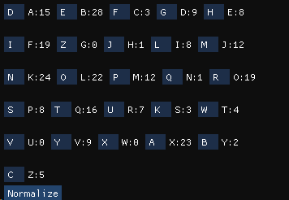

# Lucrearea de laborator Nr.1 la Criptanaliza

A elaborat: *Curmanschii Anton, IA1901*.

Vedeți [Github](https://github.com/AntonC9018/uni_cryptanalysis). 

## Conținutul

- [Lucrearea de laborator Nr.1 la Criptanaliza](#lucrearea-de-laborator-nr1-la-criptanaliza)
  - [Conținutul](#conținutul)
  - [Introducere](#introducere)
  - [Exercițiile](#exercițiile)
    - [1. Cifrul Caesar.](#1-cifrul-caesar)
    - [2. Cifru cu substituție](#2-cifru-cu-substituție)
    - [Ex. 3 a)](#ex-3-a)
  - [Remarci](#remarci)
    - [Binding-urile Imgui](#binding-urile-imgui)
    - [De ce nu m-am oprit la binding-urile inițiale pe care le-am găsit și înainte de aceste 4 zile?](#de-ce-nu-m-am-oprit-la-binding-urile-inițiale-pe-care-le-am-găsit-și-înainte-de-aceste-4-zile)

## Introducere

Am implementat o interfață grafică în limbajul [D](https://dlang.org/), utilizând [Imgui](https://github.com/ocornut/imgui) pe baza de [GLFW](https://www.glfw.org/) și [OpenGL](https://www.opengl.org/).

## Exercițiile

### 1. Cifrul Caesar.

**Sarcina:** Folosind analiza frecvenței literelor, determinați conținutul următorului mesaj care a fost obținut prin aplicarea cifrului Caesar.

```
MAXLX TKXGM MAXWK HBWLR HNKXE HHDBG ZYHK
```

Am făcut un modul ce vizualizează frecvențele literelor într-un text.
Încă nu fac sortarea după frecvența.


Codul este destul de simplu, [vedeți după link](https://github.com/AntonC9018/uni_cryptanalysis/blob/9d20c6838edfa86313602813d1a53d7b6ab890b3/source/app.d#L67-L210).

Momentul principal care calculează frecvențele este realizat astfel.
Am făcut o structură ce permite indexarea unui tablou prin litere.
Funcția `countLetterFrequencies()` trece prin toate literele unui 'slice' (pointer + lungime) nul-terminat (lungimea aici este utilizată numai pentru bounds checking, previne bug-uri).
```d
struct AlphabetMap(T)
{
    T[letterCount] arrayof;

    ref auto opIndex(char ch)
    {
        return arrayof[ch - 'A'];
    }
}

AlphabetMap!ulong countLetterFrequencies(char[] str)
{
    import std.ascii;

    AlphabetMap!ulong result;

    for (size_t i = 0;; i++)
    {
        if (str[i] == 0)
            return result;

        str[i] = toUpper(str[i]);

        if (isAlpha(str[i]))
            result[str[i]] += 1;
    }
}
```

Cea mai des întâlnita literă în alfabetul englez este 'e', iar în textul nostru cea mai desa literă este 'x'.
Ghicim că litera 'x' corespunde literii 'e', sau în alte cuvinte, cifrul cezarului a mișcat litera 'e' cu 'e' - 'x' poziții.

$ x - e = 5 - 24 = -19 \equiv 7 \mod 26 $.

Am mai făcut o interfață simplă pentru cezar. 
Aici am introdus textul criptat, și numărul 7, și am primit textul decriptat lizibil.


Codul se încape în [40 de linii într-o singură clasă](https://github.com/AntonC9018/uni_cryptanalysis/blob/9d20c6838edfa86313602813d1a53d7b6ab890b3/source/app.d#L20-L65):

Deci, am primit răspunsul *THESE AREN'T THE DROIDS YOU'RE LOOKING FOR*.


### 2. Cifru cu substituție

Un cifru cu substituțiile, spațiile sunt păstrate.

```
LKZB RMLK X JFAKFDEQ AOBXOV TEFIB F MLKABOBA TBXH XKA TBXOV LSBO 
JXKV X NRXFKQ XKA ZROFLRP SLIRJB LC CLODLQQBK ILOB TEFIB F KLAABA 
KBXOIV KXMMFKD PRAABKIV QEBOB ZXJB X QXMMFKD XP LC PLJB LKB 
DBKQIV OXMMFKD OXMMFKD XQ JV ZEXJYBO ALLO Q FP PLJB SFPFQBO F 
JRQQBOBA QXMMFKD XQ JV ZEXJYBO ALLO LKIV QEFP XKA KLQEFKD JLOB
```

Limba engleza conține doar două cuvinte de lungimea 1, 'A' și 'I'.
Însă textul clar conține 3 cuvinte cu o singură literă: 'X', 'F', 'Q'. 
Ori avem o anomalie, ori cifrul nu criptează 1 la 1, ori este într-o altă limbă.
Ne mișcăm mai departe presupunând că e o anomalie.

'XKA' se repetă de 3 ori, cel mai probabil este 'THE' ori 'AND', însă 'X' nu poate fi 'T', deoarece este una din 'A' sau 'I'. Deci 'X' este cel mai probabil 'A', 'K' este 'N', iar 'A' este 'D'.

Pentru comoditatea încercărilor, ca toate literele să fie folosite la orice moment fără corectări manuale, am făcut un buton `Normalize`. Când îl apăsați, găsește toate literele care nu au fost folosite, precum și cele care sunt folosite de mai multe ori, și schimbă acestea cu cele nefolosite. Problema este că chiar dacă numai ce ați schimbat una sau mai multe litere și vreți ca ele să rămână neschimbate, există o posibilitate că ele să fie resubstituite înapoi de așa algoritm. 

Am elaborat un algoritm ceva mai complicat care utilizează o coadă circulară unde pune indicii literelor când utilizatorul le schimbă, și pe urmă utilizează acea coadă pentru a determina ce litere să schimbe. Iată implementarea [coadei circulare](https://github.com/AntonC9018/uni_cryptanalysis/blob/aa44a06e222f8a83e2edd331ecd04436ac1881d3/source/app.d#L92-L181), și [partea principală a algoritmului](https://github.com/AntonC9018/uni_cryptanalysis/blob/aa44a06e222f8a83e2edd331ecd04436ac1881d3/source/app.d#L232-L343). M-am oprit când am văzut că lucrează corect, se mai  poate face refactoring, evident. (Cu totul nu am pierdul 5 ore la aceasta.)

Acum avem:


```
LNZB RMLN A JFDNFEKQ DOBAOV TKFIB F MLNDBOBD TBAH AND TBAOV LSBO 
JANV A XRAFNQ AND ZROFLRP SLIRJB LC CLOELQQBN ILOB TKFIB F NLDDBD 
NBAOIV NAMMFNE PRDDBNIV QKBOB ZAJB A QAMMFNE AP LC PLJB LNB 
EBNQIV OAMMFNE OAMMFNE AQ JV ZKAJYBO DLLO Q FP PLJB SFPFQBO F 
JRQQBOBD QAMMFNE AQ JV ZKAJYBO DLLO LNIV QKFP AND NLQKFNE JLOB
```

Cele mai comune litere din text sunt 'B' - 28, 'K' - 24, 'X' - 23, 'L' - 22. 'B' este cel mai probabil 'E' după frecvența, dar putem și raționaliza. 'K' deja presupunem că este 'N', 'X' tot, 'L' nu poate fi 'E', deoarece cuvintele care încep cu 'E' nu sunt tare comune, însă în textul avem LC de mai multe ori. Presupunem că 'B' este 'E'.

Deci literele pe care le cunoaștem sunt 'ANDE'.

Avem un cuvânt suspicios, LNE, 'L' este probabil 'O'.

Avem două cuvinte de două litere care încep cu 'A': AP și AQ. Sunt cel mai probabil unele dintre AS, AT, AM sau AN.
Nu poate fi AN, deoarece N deja se cunoaște. Deci, 'P' și 'Q' sunt între 'S', 'T' sau 'M'. 

Frecvența literelor 'P' este 8, iar lui 'Q' - 16. 'T' este mai comună în engleză, deci fixăm 'Q' la 'T'.
Atunci 'P' este ori 'S' ori 'M'.

'F' este cel mai probabil 'I', deci vom fixa aceasta.


```
ONZE RMON A JIDNIBKT DLEALV QKIFE I MONDELED QEAH AND QEALV OSEL 
JANV A XRAINT AND ZRLIORP SOFRJE OC COLBOTTEN FOLE QKIFE I NODDED 
NEALFV NAMMINB PRDDENFV TKELE ZAJE A TAMMINB AP OC POJE ONE 
BENTFV LAMMINB LAMMINB AT JV ZKAJYEL DOOL T IP POJE SIPITEL I 
JRTTELED TAMMINB AT JV ZKAJYEL DOOL ONFV TKIP AND NOTKINB JOLE
```

NAMMINB, TAMMINB, LAMMINB termină cu INB. Această 'B' cel mai probabil este 'G'. 'D' arată 'G', deci setăm 'D' la 'G'.

ANDITGE sunt literele fixate.

DLEALV = DREARY, NEALFV = NEARLY, GENTFV = GENTLY, Deci ceea ce este acum la 'F' se duce la 'L', iar ceea ce este la 'V' se duce la 'Y'. (aici am înțeles că butonul meu nu prea are sens, și încă că nu lucrează perfect).

JIDNIGKT este evident MIDNIGHT  și mai unele substituții devin aparente după aceasta.

ONZE = ONCE

RMON = UPON

etc.



```
ONCE UPON A MIDNIGHT DREARY WHILE I PONDERED WEAJ AND WEARY OKER 
MANY A QUAINT AND CURIOUS KOLUME OF FORGOTTEN LORE WHILE I NODDED 
NEARLY NAPPING SUDDENLY THERE CAME A TAPPING AS OF SOME ONE 
GENTLY RAPPING RAPPING AT MY CHAMBER DOOR T IS SOME KISITER I 
MUTTERED TAPPING AT MY CHAMBER DOOR ONLY THIS AND NOTHING MORE
```

KISITER = VISITER

WEAJ = WEAK

```
ONCE UPON A MIDNIGHT DREARY WHILE I PONDERED WEAK AND WEARY OVER 
MANY A QUAINT AND CURIOUS VOLUME OF FORGOTTEN LORE WHILE I NODDED 
NEARLY NAPPING SUDDENLY THERE CAME A TAPPING AS OF SOME ONE 
GENTLY RAPPING RAPPING AT MY CHAMBER DOOR T IS SOME VISITER I 
MUTTERED TAPPING AT MY CHAMBER DOOR ONLY THIS AND NOTHING MORE
```

[Edgar Allan Poe, The Raven](https://www.poetryfoundation.org/poems/48860/the-raven)

Substituțiile finale:


### Ex. 3 a)

```
YMJRJ  YMTIT  QTLDG  JMNSI  KWJVZ  JSHDF  SFQDX  NXWJQ  NJXTS  YMJKF  HYYMF  YNSFS  DQFSL 
ZFLJJ FHMQJ YYJWM FXNYX TBSUJ WXTSF QNYDY MJRTX YTGAN TZXYW FNYYM FYQJY YJWXM 
FAJNX YMJKW JVZJS HDBNY MBMNH MYMJD FUUJF WNSFQ FSLZF LJHQJ FWQDN SJSLQ NXMYM 
JQJYY JWEFU UJFWX KFWQJ XXKWJ VZJSY QDYMF SXFDF NSYNR JXLTS JGDNK DTZBF SYJIY TKNSI 
TZYYM JKWJV ZJSHN JXTKQ JYYJW XBNYM NSFQF SLZFL JDTZM FIYTK NSIFQ FWLJU NJHJT KYJCY 
FSIHT  ZSYJF  HMKWJ  VZJSH  DSTBM  TBJAJ  WBJMF  AJHTR  UZYJW  XYMFY  HFSIT  YMJMF  WIBTW 
PKTWZ XGZYN SKFHY BJITS YJAJS SJJIY TITYM NXXYJ UFXKT WRTXY QFSLZ FLJXY MJWJF WJIFY 
FGFXJ  XTKYM  JQJYY  JWKWJ  VZJSH  NJXBM  NHMMF  AJGJJ  SHFQH  ZQFYJ  IGDQT  TPNSL  FYRNQ 
QNTSX TKYJC YXFSI FWJYM ZXAJW DMNLM QDFHH ZWFYJ
```

Vom încerca substituțiile chiar după frecvențele literelor.
Dacă substituim toate caracterele după frecvențele, primi așa ceva:

```
TNEVE  TNIWI  LIYMB  ENHOW  CREKD  EOUMA  OALMS  HSREL  HESIO  TNECA  UTTNA  THOAO  MLAOY 
DAYEE AUNLE TTERN ASHTS IFOGE RSIOA LHTMT NEVIS TIBPH IDSTR AHTTN ATLET TERSN 
APEHS TNECR EKDEO UMFHT NFNHU NTNEM AGGEA RHOAL AOYDA YEULE ARLMH OEOYL HSNTN 
ELETT ERQAG GEARS CARLE SSCRE KDEOT LMTNA OSAMA HOTHV ESYIO EBMHC MIDFA OTEWT ICHOW 
IDTTN ECREK DEOUH ESICL ETTER SFHTN HOALA OYDAY EMIDN AWTIC HOWAL ARYEG HEUEI CTEJT 
AOWUI  DOTEA  UNCRE  KDEOU  MOIFN  IFEPE  RFENA  PEUIV  GDTER  STNAT  UAOWI  TNENA  RWFIR 
XCIRD SBDTH OCAUT FEWIO TEPEO OEEWT IWITN HSSTE GASCI RVIST LAOYD AYEST NEREA REWAT 
ABASE  SICTN  ELETT  ERCRE  KDEOU  HESFN  HUNNA  PEBEE  OUALU  DLATE  WBMLI  IXHOY  ATVHL 
LHIOS ICTEJ TSAOW ARETN DSPER MNHYN LMAUU DRATE
```

Nu ne dă prea mult. Vom încerca din nou.

Vom substitui doar J la E, Y la T și F la A. Avem:

```
tMeRe  tMTIT  QTLDG  eMNSI  KWeVZ  eSHDa  SaQDX  NXWeQ  NeXTS  tMeKa  HttMa  tNSaS  DQaSL 
ZaLee aHMQe tteWM aXNtX TBSUe WXTSa QNtDt MeRTX tTGAN TZXtW aNttM atQet teWXM 
aAeNX tMeKW eVZeS HDBNt MBMNH MtMeD aUUea WNSaQ aSLZa LeHQe aWQDN SeSLQ NXMtM 
eQett eWEaU UeaWX KaWQe XXKWe VZeSt QDtMa SXaDa NStNR eXLTS eGDNK DTZBa SteIt TKNSI 
TZttM eKWeV ZeSHN eXTKQ etteW XBNtM NSaQa SLZaL eDTZM aItTK NSIaQ aWLeU NeHeT KteCt 
aSIHT  ZStea  HMKWe  VZeSH  DSTBM  TBeAe  WBeMa  AeHTR  UZteW  XtMat  HaSIT  tMeMa  WIBTW 
PKTWZ XGZtN SKaHt BeITS teAeS SeeIt TITtM NXXte UaXKT WRTXt QaSLZ aLeXt MeWea WeIat 
aGaXe  XTKtM  eQett  eWKWe  VZeSH  NeXBM  NHMMa  AeGee  SHaQH  ZQate  IGDQT  TPNSL  atRNQ 
QNTSX TKteC tXaSI aWetM ZXAeW DMNLM QDaHH ZWate
```

tM se întâlnește des, deci M probabil este H.

```
theRe  thTIT  QTLDG  ehNSI  KWeVZ  eSHDa  SaQDX  NXWeQ  NeXTS  theKa  Httha  tNSaS  DQaSL 
ZaLee aHhQe tteWh aXNtX TBSUe WXTSa QNtDt heRTX tTGAN TZXtW aNtth atQet teWXh 
aAeNX theKW eVZeS HDBNt hBhNH htheD aUUea WNSaQ aSLZa LeHQe aWQDN SeSLQ NXhth 
eQett eWEaU UeaWX KaWQe XXKWe VZeSt QDtha SXaDa NStNR eXLTS eGDNK DTZBa SteIt TKNSI 
TZtth eKWeV ZeSHN eXTKQ etteW XBNth NSaQa SLZaL eDTZh aItTK NSIaQ aWLeU NeHeT KteCt 
aSIHT  ZStea  HhKWe  VZeSH  DSTBh  TBeAe  WBeha  AeHTR  UZteW  Xthat  HaSIT  theha  WIBTW 
PKTWZ XGZtN SKaHt BeITS teAeS SeeIt TITth NXXte UaXKT WRTXt QaSLZ aLeXt heWea WeIat 
aGaXe  XTKth  eQett  eWKWe  VZeSH  NeXBh  NHhha  AeGee  SHaQH  ZQate  IGDQT  TPNSL  atRNQ 
QNTSX TKteC tXaSI aWeth ZXAeW DhNLh QDaHH ZWate
```

Deja vedem cuvintele the, that. 

theRe: poate fi theme, these sau there. Deci $ s(R) \in { M, S, R } $.

Ne uităm la trigramele cu A, străduindu-se să găsim AND: aQD, aSL, aXN, aQN, aUU, aWN, aSL, aWQ, aUU, aWX, aWQ, aSX, aNS, aSL, aWL, aSI, aSI, aXK, aSL, aQH, aSI, aHH.

Observăm și aUUeaW care apare de 2 ori. 

De două ori avem conbinația haAe. Este precis începutul unui cuvând, deoarece nu există cuvintele unde h stă după e sau h.
Nu poate fi hate, deoarece deja am substituit T, deci este have, hare sau haze, dar cel mai probabil have.

```
theRe  thTIT  QTLDG  ehNSI  KWeVZ  eSHDa  SaQDX  NXWeQ  NeXTS  theKa  Httha  tNSaS  DQaSL 
ZaLee aHhQe tteWh aXNtX TBSUe WXTSa QNtDt heRTX tTGvN TZXtW aNtth atQet teWXh 
aveNX theKW eVZeS HDBNt hBhNH htheD aUUea WNSaQ aSLZa LeHQe aWQDN SeSLQ NXhth 
eQett eWEaU UeaWX KaWQe XXKWe VZeSt QDtha SXaDa NStNR eXLTS eGDNK DTZBa SteIt TKNSI 
TZtth eKWeV ZeSHN eXTKQ etteW XBNth NSaQa SLZaL eDTZh aItTK NSIaQ aWLeU NeHeT KteCt 
aSIHT  ZStea  HhKWe  VZeSH  DSTBh  TBeve  WBeha  veHTR  UZteW  Xthat  HaSIT  theha  WIBTW 
PKTWZ XGZtN SKaHt BeITS teveS SeeIt TITth NXXte UaXKT WRTXt QaSLZ aLeXt heWea WeIat 
aGaXe  XTKth  eQett  eWKWe  VZeSH  NeXBh  NHhha  veGee  SHaQH  ZQate  IGDQT  TPNSL  atRNQ 
QNTSX TKteC tXaSI aWeth ZXveW DhNLh QDaHH ZWate
```

Qet teW apare de mai multe ori. Este or LETTER, ori BETTERm dar cel mai probabil BETTER, deci vom substitui.

```
theRe  thTIT  bTLDG  ehNSI  KreVZ  eSHDa  SabDX  NXreb  NeXTS  theKa  Httha  tNSaS  DbaSL 
ZaLee aHhbe tterh aXNtX TBSUe rXTSa bNtDt heRTX tTGvN TZXtr aNtth atbet terXh 
aveNX theKr eVZeS HDBNt hBhNH htheD aUUea rNSab aSLZa LeHbe arbDN SeSLb NXhth 
ebett erEaU UearX Karbe XXKre VZeSt bDtha SXaDa NStNR eXLTS eGDNK DTZBa SteIt TKNSI 
TZtth eKreV ZeSHN eXTKb etter XBNth NSaba SLZaL eDTZh aItTK NSIab arLeU NeHeT KteCt 
aSIHT  ZStea  HhKre  VZeSH  DSTBh  TBeve  rBeha  veHTR  UZter  Xthat  HaSIT  theha  rIBTr 
PKTrZ XGZtN SKaHt BeITS teveS SeeIt TITth NXXte UaXKT rRTXt baSLZ aLeXt herea reIat 
aGaXe  XTKth  ebett  erKre  VZeSH  NeXBh  NHhha  veGee  SHabH  Zbate  IGDbT  TPNSL  atRNb 
bNTSX TKteC tXaSI areth ZXver DhNLh bDaHH Zrate
```

Avem combinația betterXhave, deci X este I.

```
theRe  thTIT  bTLDG  ehNSI  KreVZ  eSHDa  SabDi  Nireb  NeiTS  theKa  Httha  tNSaS  DbaSL 
ZaLee aHhbe tterh aiNti TBSUe riTSa bNtDt heRTi tTGvN TZitr aNtth atbet terih 
aveNi theKr eVZeS HDBNt hBhNH htheD aUUea rNSab aSLZa LeHbe arbDN SeSLb Nihth 
ebett erEaU Ueari Karbe iiKre VZeSt bDtha SiaDa NStNR eiLTS eGDNK DTZBa SteIt TKNSI 
TZtth eKreV ZeSHN eiTKb etter iBNth NSaba SLZaL eDTZh aItTK NSIab arLeU NeHeT KteCt 
aSIHT  ZStea  HhKre  VZeSH  DSTBh  TBeve  rBeha  veHTR  UZter  ithat  HaSIT  theha  rIBTr 
PKTrZ iGZtN SKaHt BeITS teveS SeeIt TITth Niite UaiKT rRTit baSLZ aLeit herea reIat 
aGaie  iTKth  ebett  erKre  VZeSH  NeiBh  NHhha  veGee  SHabH  Zbate  IGDbT  TPNSL  atRNb 
bNTSi TKteC tiaSI areth Ziver DhNLh bDaHH Zrate
```

H este ori G ori S (avem Hhh, implică că Hh este sfârșitul cuvântului, deci este thigh/trough/though/through etc, ori anguish/polish etc.) 

`th Niite Uai` este o combinație interesantă. Nu există cuvintele care au ii una după alta, deci ite este partea unui cunvânt nou. iteU este 100% item, nu există alte cuvinte de așa formă.

Am făcut aici și substituția (temporar) T -> O (după frecvența).

```
theRe  thoIo  boLDG  ehNSI  KreVZ  eSHDa  SabDi  Nireb  NeioS  theKa  Httha  tNSaS  DbaSL 
ZaLee aHhbe tterh aiNti oBSme rioSa bNtDt heRoi toGvN oZitr aNtth atbet terih 
aveNi theKr eVZeS HDBNt hBhNH htheD ammea rNSab aSLZa LeHbe arbDN SeSLb Nihth 
ebett erEam meari Karbe iiKre VZeSt bDtha SiaDa NStNR eiLoS eGDNK DoZBa SteIt oKNSI 
oZtth eKreV ZeSHN eioKb etter iBNth NSaba SLZaL eDoZh aItoK NSIab arLem NeHeo KteCt 
aSIHo  ZStea  HhKre  VZeSH  DSoBh  oBeve  rBeha  veHoR  mZter  ithat  HaSIo  theha  rIBor 
PKorZ iGZtN SKaHt BeIoS teveS SeeIt oIoth Niite maiKo rRoit baSLZ aLeit herea reIat 
aGaie  ioKth  ebett  erKre  VZeSH  NeiBh  NHhha  veGee  SHabH  Zbate  IGDbo  oPNSL  atRNb 
bNoSi oKteC tiaSI areth Ziver DhNLh bDaHH Zrate
```

`theKa  Httha  t` implică că KaHt este un cuvânt, și este un obiect (the ceva that). Variantele: part, cart, bait, east, fact, gait, pact. Cel mai probabil este fact (există și fraza the fact that).

```
theRe  thoIo  boLDG  ehNSI  freVZ  eScDa  SabDi  Nireb  NeioS  thefa  cttha  tNSaS  DbaSL 
ZaLee achbe tterh aiNti oBSme rioSa bNtDt heRoi toGvN oZitr aNtth atbet terih 
aveNi thefr eVZeS cDBNt hBhNc htheD ammea rNSab aSLZa Lecbe arbDN SeSLb Nihth 
ebett erEam meari farbe iifre VZeSt bDtha SiaDa NStNR eiLoS eGDNf DoZBa SteIt ofNSI 
oZtth efreV ZeScN eiofb etter iBNth NSaba SLZaL eDoZh aItof NSIab arLem Neceo fteCt 
aSIco  ZStea  chfre  VZeSc  DSoBh  oBeve  rBeha  vecoR  mZter  ithat  caSIo  theha  rIBor 
PforZ iGZtN Sfact BeIoS teveS SeeIt oIoth Niite maifo rRoit baSLZ aLeit herea reIat 
aGaie  iofth  ebett  erfre  VZeSc  NeiBh  Nchha  veGee  Scabc  Zbate  IGDbo  oPNSL  atRNb 
bNoSi ofteC tiaSI areth Ziver DhNLh bDacc Zrate
```

Combinația `freVZeS` se întâlnește de 7 ori. În unele cazuri avem the înainte de ea, deci este un cuvând separat. în 4 cazuri din 7 mai avem c după S. Poate fi fresh sau freak. Dacă freak, atunci eS poate fi freaked.

B nu-mi pare bună substituția, vedem aba, arb, hb, etc., deci o voi scoate. Pe O tot o voi scoate.

```
theRe  thTIT  QTLDG  ehNSI  freVZ  eScDa  SaQDi  NireQ  NeiTS  thefa  cttha  tNSaS  DQaSL 
ZaLee achQe tterh aiNti TBSme riTSa QNtDt heRTi tTGvN TZitr aNtth atQet terih 
aveNi thefr eVZeS cDBNt hBhNc htheD ammea rNSaQ aSLZa LecQe arQDN SeSLQ Nihth 
eQett erEam meari farQe iifre VZeSt QDtha SiaDa NStNR eiLTS eGDNf DTZBa SteIt TfNSI 
TZtth efreV ZeScN eiTfQ etter iBNth NSaQa SLZaL eDTZh aItTf NSIaQ arLem NeceT fteCt 
aSIcT  ZStea  chfre  VZeSc  DSTBh  TBeve  rBeha  vecTR  mZter  ithat  caSIT  theha  rIBTr 
PfTrZ iGZtN Sfact BeITS teveS SeeIt TITth Niite maifT rRTit QaSLZ aLeit herea reIat 
aGaie  iTfth  eQett  erfre  VZeSc  NeiBh  Nchha  veGee  ScaQc  ZQate  IGDQT  TPNSL  atRNQ 
QNTSi TfteC tiaSI areth Ziver DhNLh QDacc Zrate
```

M-am dat seama de `acc Zrate`. Z precis este U.

```
theRe  thTIT  QTLDG  ehNSI  freVu  eScDa  SaQDi  NireQ  NeiTS  thefa  cttha  tNSaS  DQaSL 
uaLee achQe tterh aiNti TBSme riTSa QNtDt heRTi tTGvN Tuitr aNtth atQet terih 
aveNi thefr eVueS cDBNt hBhNc htheD ammea rNSaQ aSLua LecQe arQDN SeSLQ Nihth 
eQett erEam meari farQe iifre VueSt QDtha SiaDa NStNR eiLTS eGDNf DTuBa SteIt TfNSI 
Tutth efreV ueScN eiTfQ etter iBNth NSaQa SLuaL eDTuh aItTf NSIaQ arLem NeceT fteCt 
aSIcT  uStea  chfre  VueSc  DSTBh  TBeve  rBeha  vecTR  muter  ithat  caSIT  theha  rIBTr 
PfTru iGutN Sfact BeITS teveS SeeIt TITth Niite maifT rRTit QaSLu aLeit herea reIat 
aGaie  iTfth  eQett  erfre  VueSc  NeiBh  Nchha  veGee  ScaQc  uQate  IGDQT  TPNSL  atRNQ 
QNTSi TfteC tiaSI areth uiver DhNLh QDacc urate
```

Sunt convins ca nu am avut dreptate cu I șu prin urmare cu M. `Nihthe` este o combinatie imoposibila. 

```
theRe  thTIT  QTLDG  ehNSI  freVu  eScDa  SaQDX  NXreQ  NeXTS  thefa  cttha  tNSaS  DQaSL 
uaLee achQe tterh aXNtX TBSUe rXTSa QNtDt heRTX tTGvN TuXtr aNtth atQet terXh 
aveNX thefr eVueS cDBNt hBhNc htheD aUUea rNSaQ aSLua LecQe arQDN SeSLQ NXhth 
eQett erEaU UearX farQe XXfre VueSt QDtha SXaDa NStNR eXLTS eGDNf DTuBa SteIt TfNSI 
Tutth efreV ueScN eXTfQ etter XBNth NSaQa SLuaL eDTuh aItTf NSIaQ arLeU NeceT fteCt 
aSIcT  uStea  chfre  VueSc  DSTBh  TBeve  rBeha  vecTR  Uuter  Xthat  caSIT  theha  rIBTr 
PfTru XGutN Sfact BeITS teveS SeeIt TITth NXXte UaXfT rRTXt QaSLu aLeXt herea reIat 
aGaXe  XTfth  eQett  erfre  VueSc  NeXBh  Nchha  veGee  ScaQc  uQate  IGDQT  TPNSL  atRNQ 
QNTSX TfteC tXaSI areth uXver DhNLh QDacc urate
```

Aș ghici că `Qet terX` este totuși letters (mai muțin probabil getter).

```
theRe  thTIT  lTLDG  ehNSI  freVu  eScDa  SalDs  Nsrel  NesTS  thefa  cttha  tNSaS  DlaSL 
uaLee achle tterh asNts TBSUe rsTSa lNtDt heRTs tTGvN Tustr aNtth atlet tersh 
aveNs thefr eVueS cDBNt hBhNc htheD aUUea rNSal aSLua Lecle arlDN SeSLl Nshth 
elett erEaU Uears farle ssfre VueSt lDtha SsaDa NStNR esLTS eGDNf DTuBa SteIt TfNSI 
Tutth efreV ueScN esTfl etter sBNth NSala SLuaL eDTuh aItTf NSIal arLeU NeceT fteCt 
aSIcT  uStea  chfre  VueSc  DSTBh  TBeve  rBeha  vecTR  Uuter  sthat  caSIT  theha  rIBTr 
PfTru sGutN Sfact BeITS teveS SeeIt TITth Nsste UasfT rRTst laSLu aLest herea reIat 
aGase  sTfth  elett  erfre  VueSc  NesBh  Nchha  veGee  Scalc  ulate  IGDlT  TPNSL  atRNl 
lNTSs TfteC tsaSI areth usver DhNLh lDacc urate
```

`cTRUuters` = computers, sunt convins.

```
theme  thoIo  loLDG  ehNSI  freVu  eScDa  SalDs  Nsrel  NesoS  thefa  cttha  tNSaS  DlaSL 
uaLee achle tterh asNts oBSpe rsoSa lNtDt hemos toGvN oustr aNtth atlet tersh 
aveNs thefr eVueS cDBNt hBhNc htheD appea rNSal aSLua Lecle arlDN SeSLl Nshth 
elett erEap pears farle ssfre VueSt lDtha SsaDa NStNm esLoS eGDNf DouBa SteIt ofNSI 
outth efreV ueScN esofl etter sBNth NSala SLuaL eDouh aItof NSIal arLep Neceo fteCt 
aSIco  uStea  chfre  VueSc  DSoBh  oBeve  rBeha  vecom  puter  sthat  caSIo  theha  rIBor 
Pforu sGutN Sfact BeIoS teveS SeeIt oIoth Nsste pasfo rmost laSLu aLest herea reIat 
aGase  softh  elett  erfre  VueSc  NesBh  Nchha  veGee  Scalc  ulate  IGDlo  oPNSL  atmNl 
lNoSs ofteC tsaSI areth usver DhNLh lDacc urate
```

`methoIoloLD` = methodology

```
theme  thodo  logyG  ehNSd  freVu  eScya  Salys  Nsrel  NesoS  thefa  cttha  tNSaS  ylaSg 
uagee achle tterh asNts oBSpe rsoSa lNtyt hemos toGvN oustr aNtth atlet tersh 
aveNs thefr eVueS cyBNt hBhNc hthey appea rNSal aSgua gecle arlyN SeSgl Nshth 
elett erEap pears farle ssfre VueSt lytha Ssaya NStNm esgoS eGyNf youBa Stedt ofNSd 
outth efreV ueScN esofl etter sBNth NSala Sguag eyouh adtof NSdal argep Neceo fteCt 
aSdco  uStea  chfre  VueSc  ySoBh  oBeve  rBeha  vecom  puter  sthat  caSdo  theha  rdBor 
Pforu sGutN Sfact BedoS teveS Seedt odoth Nsste pasfo rmost laSgu agest herea redat 
aGase  softh  elett  erfre  VueSc  NesBh  Nchha  veGee  Scalc  ulate  dGylo  oPNSg  atmNl 
lNoSs ofteC tsaSd areth usver yhNgh lyacc urate
```

`aSalysNs` = analysis

```
theme  thodo  logyG  ehind  freVu  encya  nalys  isrel  ieson  thefa  cttha  tinan  ylang 
uagee achle tterh asits oBnpe rsona lityt hemos toGvi oustr aitth atlet tersh 
aveis thefr eVuen cyBit hBhic hthey appea rinal angua gecle arlyi nengl ishth 
elett erEap pears farle ssfre Vuent lytha nsaya intim esgon eGyif youBa ntedt ofind 
outth efreV uenci esofl etter sBith inala nguag eyouh adtof indal argep ieceo fteCt 
andco  untea  chfre  Vuenc  ynoBh  oBeve  rBeha  vecom  puter  sthat  cando  theha  rdBor 
Pforu sGuti nfact Bedon teven needt odoth isste pasfo rmost langu agest herea redat 
aGase  softh  elett  erfre  Vuenc  iesBh  ichha  veGee  ncalc  ulate  dGylo  oPing  atmil 
lions ofteC tsand areth usver yhigh lyacc urate
```

`has its oBn personality`; B = w

```
theme  thodo  logyG  ehind  freVu  encya  nalys  isrel  ieson  thefa  cttha  tinan  ylang 
uagee achle tterh asits ownpe rsona lityt hemos toGvi oustr aitth atlet tersh 
aveis thefr eVuen cywit hwhic hthey appea rinal angua gecle arlyi nengl ishth 
elett erEap pears farle ssfre Vuent lytha nsaya intim esgon eGyif youwa ntedt ofind 
outth efreV uenci esofl etter swith inala nguag eyouh adtof indal argep ieceo fteCt 
andco  untea  chfre  Vuenc  ynowh  oweve  rweha  vecom  puter  sthat  cando  theha  rdwor 
Pforu sGuti nfact wedon teven needt odoth isste pasfo rmost langu agest herea redat 
aGase  softh  elett  erfre  Vuenc  ieswh  ichha  veGee  ncalc  ulate  dGylo  oPing  atmil 
lions ofteC tsand areth usver yhigh lyacc urate
```

`Gehind` = behind

```
theme  thodo  logyb  ehind  freVu  encya  nalys  isrel  ieson  thefa  cttha  tinan  ylang 
uagee achle tterh asits ownpe rsona lityt hemos tobvi oustr aitth atlet tersh 
aveis thefr eVuen cywit hwhic hthey appea rinal angua gecle arlyi nengl ishth 
elett erEap pears farle ssfre Vuent lytha nsaya intim esgon ebyif youwa ntedt ofind 
outth efreV uenci esofl etter swith inala nguag eyouh adtof indal argep ieceo fteCt 
andco  untea  chfre  Vuenc  ynowh  oweve  rweha  vecom  puter  sthat  cando  theha  rdwor 
Pforu sbuti nfact wedon teven needt odoth isste pasfo rmost langu agest herea redat 
abase  softh  elett  erfre  Vuenc  ieswh  ichha  vebee  ncalc  ulate  dbylo  oPing  atmil 
lions ofteC tsand areth usver yhigh lyacc urate
```

`freVuency` = frequency

```
the methodology behind frequency analysis relies on the fact that in any language
each letter has its own personality. the most obvious trait that letters have is the
frequency with which they appear in a language. clearly, in english the letter 
E = z/j 
appears far less frequently than, say, a in times gone by if you wanted to find 
out the frequencies of letters within a language you had to find a large piece of
teCt = text, C = x
and count each frequency. now, however, we have computers that can do the hard 
worP = work, P = k
for us, but in fact we don't even need to do this step as for most languages there
are databases of the letter frequencies which have been calculated by looking  
at millions of texts and are thus very highly accurate.
```

## Remarci

### Binding-urile Imgui

Este urât că imgui (încă) nu poate fi utilizat în D direct (este scris în limbajul C++), deci se utilizează așa numite binding-urile.
În esența funcțiile se iau după nume ori din librăria statică cu extensia `lib`, ori din librăria dinamică `dll` în timpul rulării.
Problema cu binding-urile este că ele de obicei nu se scriu manual, deoarece necesită munca plicitisitoare, ci generate prin traducerea fișierilor header în limbajul-țintă automatizată, sau semi-automatizată (traducerea inițială + unele corectări manuale).
Aceste instrumente ori nu sunt tare bune, ori sunt dificil de rulate, ori necesită îngrijire care autorii nu au timp s-o furnizeze, de aceea (încă) nu este posibil de generat așa binding-uri pentru orice librărie într-un mod simplu și standartizat.

Am pierdut 4 zile încercând să aduc un proiect de generare a binding-urilor la o stare bună, însă când îmi părea că am terminat și că este destul de bun, de fapt l-am încercat și am înțeles că nu merge. 
Mai necesită prea multe lucruri pentru a fi considerat plăcut de utilizat, însă eu nu mai pot să-mi aloc timpul pentru aceasta.

### De ce nu m-am oprit la binding-urile inițiale pe care le-am găsit și înainte de aceste 4 zile?

În ImGui există 2 ramure — `master` și `docking`. 
Docking-ul este foarte interesant, deoarece permite gruparea comodă a ferestrelor, însă binding-urile inițiale nu l-au suportat.
De aceea