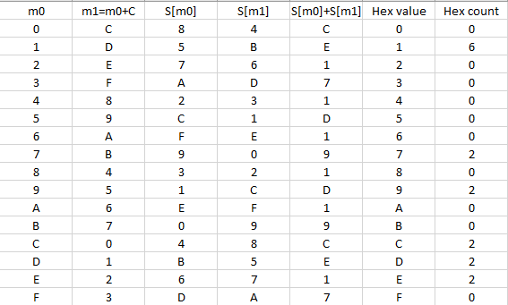

# Lucrearea de individuală Nr.1 la Criptanaliza

Tema: **Calculul diferențelor**.

A elaborat: *Curmanschii Anton, IA1901*.

Vedeți [Github](https://github.com/AntonC9018/uni_cryptanalysis). 

## Sarcina 

Construiți tabelul distribuțiilor de diferențe asociat S-boxei S, definite astfel:

|       | | | | | | | | | | | | | | | | |
|-------|-|-|-|-|-|-|-|-|-|-|-|-|-|-|-|-|
|$ x $  |0|1|2|3|4|5|6|7|8|9|A|B|C|D|E|F|
|$ S_x $|8|5|7|A|2|C|F|9|3|1|E|0|4|B|6|D|

## Realizarea

Am scris un program ce determină ce diferența $ c $ produce anomalia maximală în valoarea $ S _ { m_0 } \oplus S _ { m_1 } $,
unde $ m_0 = x $, iar $ m_1 = x \oplus c $.
După ce găsește $ c $, creează un tabel în formatul csv, care poate fi citit în, de exemplu, Excel.
[Codul](https://github.com/AntonC9018/uni_cryptanalysis/blob/e43e4f9770e79db9c7809a8a556913f5e5b30d27/source/stuff/diffs.d) este super simplu.


## Executarea

Rulez utilizând următoarea comandă:

```
dmd -run diffs.d > result.csv
```

Conținutul fișierul creat de program:

```
m0,m1=m0+C,S[m0],S[m1],S[m0]+S[m1],Hex value,Hex count
0,C,8,4,C,0,0,
1,D,5,B,E,1,6,
2,E,7,6,1,2,0,
3,F,A,D,7,3,0,
4,8,2,3,1,4,0,
5,9,C,1,D,5,0,
6,A,F,E,1,6,0,
7,B,9,0,9,7,2,
8,4,3,2,1,8,0,
9,5,1,C,D,9,2,
A,6,E,F,1,A,0,
B,7,0,9,9,B,0,
C,0,4,8,C,C,2,
D,1,B,5,E,D,2,
E,2,6,7,1,E,2,
F,3,D,A,7,F,0,
```

Fișierul de output, deschis în excel, după ajustări mici (centrarea textului):


